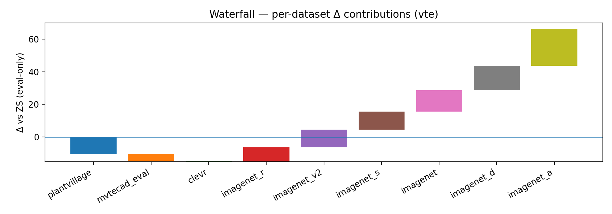
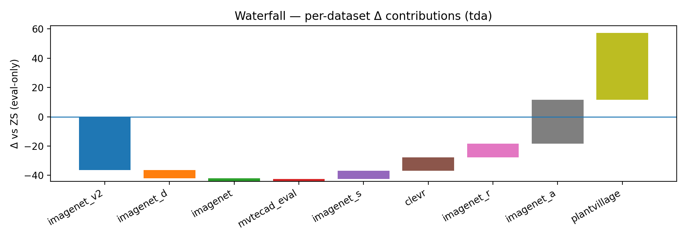
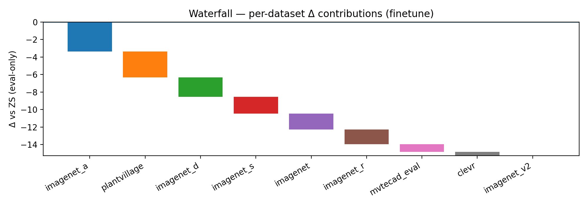
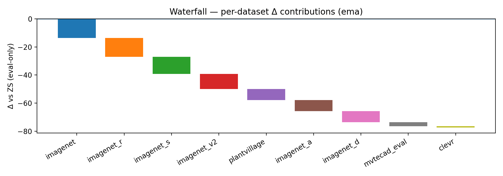
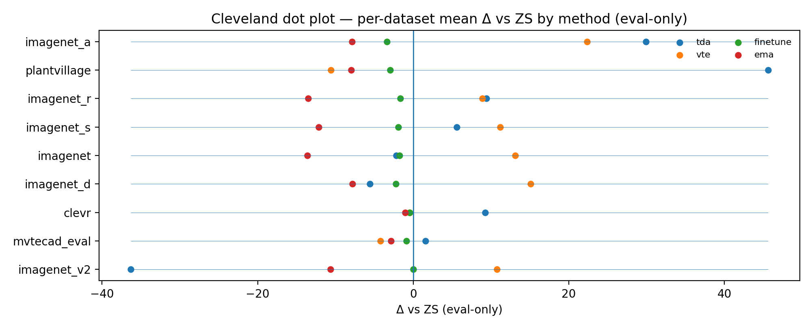

# The Practitioner's Guide to Continual Multimodal Pretraining

Short version published at ___NeurIPS 2024 (Dataset and Benchmarks Track)___ and at the ___NeurIPS 2024 ContinualFomo Workshop (Oral)___.

-----------------------------

__:pen: Authors:__
Karsten Roth$^*$, Vishaal Udandarao$^*$, Sebastian Dziadzio$^\circ$, Ameya Prabhu$^\circ$, Mehdi Cherti, Oriol Vinyals, Olivier J. Henaff, Samuel Albanie$^\dagger$, Matthias Bethge$^\dagger$, Zeynep Akata$^\dagger$.  
$^*$equal interchangeable, $^\circ$core contributor, $^\dagger$ shared senior

__:eyes: Summary:__


This repository contains the complete __Fomo-in-Flux (FiF)__ pipeline introduced in [our work](https://arxiv.org/abs/2408.14471) (NeurIPS Dataset & Benchmark track 2024) and used in our [follow-up work on temporal model merging](https://arxiv.org/abs/2412.06712), and contains the following components:

* Entire __FiF__ pipeline from precise data streaming to cost budgeting and evaluation.
* Configurations and mostly complete automatic download links to most of the 63 datasets used for adaptation and evaluation. More information in the respective data section.
* Implementation of parameter-additive and -selective update methods, standard continual learning mechanisms, finetuning techniques and model merging approaches.
* Precomputed data streams mimicking different deployment scenarios described in our paper.
* An extensive evaluation on 21 different datasets.
* Result logging using Weights & Biases.

__Moreover__, this codebase is easily used as a general powerful continual pretraining pipeline to study multimodal representation models.

-----------------------------

__:exclamation: Some disclaimer:__  

* If you find any licensing issues with our redistribution links, please let us know, and we will take it down immediately and replace it with suitable preprocessing scripts!
* Due to licensing and hosting issues, we were not able to provide preprocessed download links for some of the pretraining datasets (particularly the pretraining replay data).
* As a 1-to-1 copy of our utilized data streams (particular w.r.t. to pretraining datasets) is not possible, slight numerical variance may be encountered during replication.
* Exact checkpoint replication is currently not possible; i.e. if a run is interrupted and resumed, results will not be the same as its uninterrupted equivalent. However, two uninterrupted runs should return the same values.

__:fire: Version History:__

* Uploaded initial version 1.0. This contains the full Fomo-in-Flux pipeline. Next change will fix some checkpointing issues currently encountered.

__:book: Citation__
If you found this repository useful for your research, please consider citing it via

```bibtex
@article{roth2024practitioner,
  title={A Practitioner's Guide to Continual Multimodal Pretraining},
  author={Roth, Karsten and Udandarao, Vishaal and Dziadzio, Sebastian and Prabhu, Ameya and Cherti, Mehdi and Vinyals, Oriol and H{\'e}naff, Olivier and Albanie, Samuel and Bethge, Matthias and Akata, Zeynep},
  journal={arXiv preprint arXiv:2408.14471},
  year={2024}
}
```

-----------------------------

## Table of Contents

- [The Practitioner's Guide to Continual Multimodal Pretraining](#the-practitioners-guide-to-continual-multimodal-pretraining)
  - [Table of Contents](#table-of-contents)
  - [1. Requirements](#1-requirements)
    - [1.1 Setting up the Fomo-in-Flux environment](#11-setting-up-the-fomo-in-flux-environment)
    - [1.2 Data Preparation](#12-data-preparation)
  - [2. Getting Started](#2-getting-started)
    - [2.1 Quick Verifications](#21-quick-verifications)
      - [2.1.1 Summarize Downloaded Datasets - Visual Inspection](#211-summarize-downloaded-datasets---visual-inspection)
      - [2.1.2 Zeroshot Evaluation](#212-zeroshot-evaluation)
    - [2.2 Starting your first FiF-experiments](#22-starting-your-first-fif-experiments)
      - [2.2.1 A first full, but short FiF verification run](#221-a-first-full-but-short-fif-verification-run)
      - [2.2.2 Continual Pretraining of ViT-B/16 on full FiF](#222-continual-pretraining-of-vit-b16-on-full-fif)
  - [3. Key settings and flags you may want to modify](#3-key-settings-and-flags-you-may-want-to-modify)
    - [3.1 Defining your experiment config file](#31-defining-your-experiment-config-file)
    - [3.2 Determining Compute Budgets: Profile \& Count GFlops](#32-determining-compute-budgets-profile--count-gflops)
    - [3.3 Fomo-in-Flux training: Key parameters](#33-fomo-in-flux-training-key-parameters)
    - [3.4 Running on data tar files](#34-running-on-data-tar-files)
    - [3.5 Multi-GPU and RAM preloading](#35-multi-gpu-and-ram-preloading)
    - [3.6 Adding your own twist to FiF](#36-adding-your-own-twist-to-fif)
      - [3.6.1 Custom dataset](#361-custom-dataset)
      - [3.6.2 Custom continual learner](#362-custom-continual-learner)
      - [3.6.3 Custom backbone](#363-custom-backbone)
    - [3.7 Running on validation splits](#37-running-on-validation-splits)
    - [3.8 Improving evaluation speeds during streaming](#38-improving-evaluation-speeds-during-streaming)
    - [3.9 Evaluation from W\&B xid](#39-evaluation-from-wb-xid)
    - [3.10 W\&B logging and checkpointing](#310-wb-logging-and-checkpointing)
- [Detailed results](#detailed-results)
  - [Per dataset results:](#per-dataset-results)
  - [Overall KA / ZS / GM:](#overall-ka--zs--gm)
  - [Waterfall:](#waterfall)
    - [VTE:](#vte)
    - [TDA:](#tda)
    - [Finetune:](#finetune)
    - [EMA:](#ema)
  - [Cleveland dot plot:](#cleveland-dot-plot)
- [Reproduce results:](#reproduce-results)
    - [FINETUNE:](#finetune-1)
    - [EMA MODEL MERGING:](#ema-model-merging)
    - [VTE:](#vte-1)
    - [TDA:](#tda-1)
  - [NOTE: Each script has to be run with the different number of tasks and samples. They can be specified using:](#note-each-script-has-to-be-run-with-the-different-number-of-tasks-and-samples-they-can-be-specified-using)
  
-----------------------------

## 1. Requirements

### 1.1 Setting up the Fomo-in-Flux environment

To utilize this repository, simply set up a corresponding environment using

```bash
conda env create -f environment.yaml
```

and activate the environment via `conda activate fif`. This should install all required libraries.

### 1.2 Data Preparation

This part is the most time-consuming, as all 63 datasets have to be downloaded and preprocessed. Fortunately, we currently provide download links for preprocessed dataset variants for __all__ adaptation and evaluation datasets. These can be downloaded using:

```bash
bash download_and_process_all_datasets.sh path/to/download/dir  # e.g. 'data'
```

This will download preprocessed dataset `tar`-files and extract them. The entire download takes about 2.5 hours with a standard 50 Mbps download speed; the total size is around 65 GB.

__Moreover__, note that while the data is extracted by default, it is also possible to conduct __FiF__-studies on the dataset tar-files directly in scenarios where total filecount is bounded (albeit slightly slower).

__Note:__
All modified datasets are provided under the same license as the originals with references below. Users are responsible for adhering to the terms of the original licenses. For reference, links to the original datasets and their licenses are included in this repository wherever possible. Any modifications, preprocessing, or enhancements applied to these datasets do not imply endorsement by the original dataset creators. When using these datasets, please ensure to reference them accordingly!

__Importantly__, these datasets have been preprocessed particularly for use within Fomo-in-Flux, and do not serve as a stand-in for the original datasets in other applications.

Here is a table of all datasets used, and the respective references and licenses we were able to verify (dataset names reference the downloaded folder names):

<details>

We now summarize all downloadable datasets. Please reference [the paper](https://arxiv.org/pdf/2408.14471) for the respective exact references!

__Adaptation Datasets:__


__Evaluation Datasets:__


__Association Table:__

| Download Name   | Table Name |
|-------------|-------------|
| AI2DIAGRAMS | AI2Diagrams|
| ARTBENCH10 | ArtBench10|
| BIRDSNAP | Birdsnap|
| CALTECH101 | Caltech101|
| CALTECH256 | Caltech256|
| CARS196 | Cars196|
| CIFAR10 | Cifar10|
| CIFAR100 | Cifar100|
| CLEVR | CLEVR|
| CLRS | CLRS|
| COUNTRY211 | Country211|
| CUB200 | CUB200-2011|
| DF20MINI | DF20-mini|
| DOLLARSTREET | Dollarstreet|
| DOMAINNET_CLIPART | Domainnet-Clipart|
| DOMAINNET_INFOGRAPH | Domainnet-Infograph|
| DOMAINNET_PAINTING | Domainnet-Painting|
| DOMAINNET_QUICKDRAW | Domainnet-Quickdraw|
| DOMAINNET_SKETCH | Domainnet-Sketch|
| DSPRITES | Dsprites|
| EuroSAT | EuroSAT|
| FashionMNIST | FashionMNIST|
| FGVCAircraft | FGVCAircraft|
| FLICKR30K | Flickr300k|
| FLOWERS102 | Flowers102|
| Food101 | Food101|
| FRU92 | FRU92|
| FSCOCO | FSCOCO|
| GTSRB | GTSRB|
| IMAGENET | ImageNet (val only)|
| IMAGENET_A | ImageNet-A|
| IMAGENET_D | ImageNet-D|
| IMAGENET_R | ImageNet-R|
| IMAGENET_S | ImageNet-S|
| IMAGENET_V2 | ImageNet-V2|
| iNATURALIST2021 | iNaturalist2021|
| ISICMELANOMA | Isicmelanoma|
| MITSTATES | Mitstates|
| MNIST | MNIST|
| MONKEYS10 | Monkeys10|
| MSCOCO | MSCOC|
| MTSD | MTSD|
| MVTECAD_Adapt | MVTEC-AD (Base)|
| MVTECAD_Eval | MVTEC-AD (Faults)|
| OBJECTNET | ObjectNet|
| OBSC_ANIMALS | Obscure Animals|
| OBSC_THINGS | Obscure Things|
| OPENIMAGES | OpenImages|
| OXFORDPETS | OxfordPets|
| PATTERNNET | PatternNet|
| PLACES365 | Places365|
| PLANTVILLAGE | Plantvillage|
| QUILT | Quilt-1M|
| RESISC45 | Resisc45|
| SHAPES3D | Shapes3D|
| SNAKECLEF | SnakeCLEF2023|
| STL10 | STL10|
| SUN397 | SUN397|
| SVHN | SVHN|
| SynthCLIP106 | SynthCLIP106|
| VEG200 | Veg200|
| ZAPPOS50k | Zappos50k|

</details>

</br>

__Datasets for manual download:__

Currently, the only data required to be manually download, is data associated with the original pretraining data:

In practical scenarios, particularly when deploying larger models, one should have access to pretraining data as well for replay during continual pretraining. We study different re-pretraining datapools in __FiF__ as well, by replaying e.g. on 2M sample subsets from `LAION-400M`, `CC-12M`, `CC-3M` or `DataComp-Small`. Respective chunks can be found on the respective hosting website (c.f. e.g https://laion.ai/blog/laion-400-open-dataset/).

We also provide download scripts in `download_laion400m` and `download_datacomp` for ease of use.

-----------------------------

## 2. Getting Started

### 2.1 Quick Verifications

#### 2.1.1 Summarize Downloaded Datasets - Visual Inspection

Once the data is downloaded, you can run:

```bash
python summarize_codebase.py
```

to verify the data. It will create exemplary image-caption dataset visualizations in the `dataset_visualizations` folder (for both `adapt/train` and `eval/test` splits).

#### 2.1.2 Zeroshot Evaluation

Next, you can run:

```bash
python main.py experiment=zeroshot_evaluation_complete.yaml experiment.backbone.name=openclip_vit_b32 experiment.backbone.cache_dir=/path/to/download/clip/checkpoints log.folder=/path/to/save/logs/
```

to run all zero-shot evaluations. Then you can verify these numbers with the numbers here:

<details>

__OpenCLIP ViT-B/32 Verification Zero-Shot Numbers:__

|Dataset Name (per `data_lib` name) | ViT-B/32 ZS Score |
|--------|--------|
|`ai2diagrams.py` | 72.7 |
|`artbench10.py` | 15.0 |
|`birdsnap.py` | 46.7 |
|`caltech101.py` | 90.7 |
|`caltech256.py` | 88.5 |
|`cars196.py` | 85.9 |
|`cifar100.py` | 75.8 |
|`cifar10.py` | 93.7 |
|`clevr.py` | 4.7 |
|`clrs.py` | 59.7 |
|`country211.py` | 14.6 |
|`cub200.py` | 64.1 |
|`df20mini.py` | 2.1 |
|`dollarstreet.py` | 5.5 |
|`domainnet_clipart.py` | 78.7 |
|`domainnet_infograph.py` | 50.9 |
|`domainnet_painting.py` | 71.9 |
|`domainnet_quickdraw.py` | 19.1 |
|`domainnet_sketch.py` | 68.9 |
|`dsprites.py` | 11.8 |
|`dtd.py` | 54.5 |
|`eurosat.py` | 49.2 |
|`fashionmnist.py` | 77.0 |
|`fgvcaircraft.py` | 23.9 |
|`flowers102.py` | 68.0 |
|`food101.py` | 82.5 |
|`fru92.py` | 50.3 |
|`gtsrb.py` | 48.6 |
|`imagenet.py` | 65.5 |
|`imagenet_a.py` | 23.1 |
|`imagenet_d.py` | 40.7 |
|`imagenet_r.py` | 73.9 |
|`imagenet_s.py` | 52.3 |
|`imagenet_v2.py` | 57.6 |
|`inaturalist2021.py` | 5.4 |
|`isicmelanoma.py` | 14.2 |
|`mitstates.py` | 25.6 |
|`mnist.py` | 69.2 |
|`monkeys10.py` | 82.7 |
|`mtsd.py` | 20.2 |
|`mvtecad_adapt.py` | 80.2 |
|`mvtecad_eval.py` | 16.8 |
|`objectnet.py` | 32.1 |
|`obsc_animals.py` | 58.9 |
|`obsc_things.py` | 54.0 |
|`openimages.py` | 49.4 |
|`oxford_pets.py` | 90.7 |
|`patternnet.py` | 63.6 |
|`places365.py` | 41.8 |
|`plantvillage.py` | 28.3 |
|`quilt.py` | 0.2 |
|`resisc45.py` | 62.5 |
|`shapes3d.py` | 16.8 |
|`snake_clef.py` | 0.3 |
|`sun397.py` | 68.2 |
|`stl10.py` | 96.4 |
|`svhn.py` | 42.8 |
|`synthclip106.py` | 41.0 |
|`veg200.py` | 32.5 |
|`zappos50k.py` | 17.5 |
|`mscoco.py` | 72.0 |
|`flickr30k.py` | 92.3 |
|`fscoco.py` | 8.1 |

</details>

</br>

For a quick __single-dataset__ evaluation, simply run e.g.

```bash
python main.py experiment=zeroshot_evaluation_complete.yaml experiment.backbone.name=openclip_vit_b32 experiment.dataset.name=['clevr'] experiment.evaluation.additional_datasets=[] experiment.backbone.cache_dir=/path/to/download/clip/checkpoints log.folder=/path/to/save/logs/
```

### 2.2 Starting your first FiF-experiments

#### 2.2.1 A first full, but short FiF verification run

To test if __all__ pipeline elements, including replay from pretraining shards, is working correctly without starting a full run, simple run

```bash
python main.py experiment=continualfomo_debug.yaml continual.method=ema_paint experiment.backbone.name=openclip_vit_b32 log.checkpoint=False experiment.task.batch_size=256 log.name=example_fif_debug_run log.use=False
```

__Note:__

* Set `log.use=False` if you want to test without `wandb`-logging. Otherwise, make sure to set `log.wandb_key` to the correct api key.
* Please set `experiment.backbone.cache_dir=<your_cache_dir> log.folder=<your_log_dir>` depending on your respective openclip/hf cache directory and the desired logging folder. If left to default, everything will be stored in the main operating folder.
* In `experiment.datasets.pretraining_data_path` you point to the subset of the original pretraining data you wish to use, e.g. `laion400m/shards`.

#### 2.2.2 Continual Pretraining of ViT-B/16 on full FiF

Example run conducting continual finetuning on the entire FiF-benchmark with respective `10%`-subset evaluation during training and full evaluation at the end of streaming:

```bash
python main.py experiment=continualfomo_default.yaml continual.method=finetune experiment.backbone.name=openclip_vit_b32 log.checkpoint=False experiment.task.batch_size=256 log.name=example_fif_full_run_with_finetune log.use=False
```

By default, this mixes pretraining, replay and streaming data equally. If you do not want to replay on buffer and pretraining data, simply set

```bash
experiment.dataset.data_mixture.pretraining=0 experiment.dataset.data_mixture.buffer=0 experiment.dataset.data_mixture.update=1.0
```

__Variations to this run:__

[1] For a `rank=64`-LoRA, simply define: `continual.method=lora continual.lora.rank=64`. Moreover, make sure to correctly set the number of allowed samples per task in `experiment.task.n_samples`.

[2] Task-arithmetic model merging:

Make sure to include:

```bash
continual.ema_paint.backbone_merge.method=task_arithmetic continual.ema_paint.head_merge.method=task_arithmetic continual.ema_paint.backbone_merge.apply_lines=False continual.ema_paint.head_merge.apply_lines=False continual.ema_paint.backbone_merge.lines_params=[0.5,0.5,True,'linear'] continual.ema_paint.head_merge.lines_params=[0.5,0.5,True,'linear']
```

Again, ensure that the number of update steps per task (as in `experiment.task.n_samples=<gflops_samples>`) are set based on the gflops required for a forward + backward pass (for the how-to, see the respective section in this readme). Note that for most method setups, Tab. 4 in [our paper](https://arxiv.org/pdf/2408.14471) contains respective GFlops (also useful for verification) and number of steps (i.e. `experiment.task.n_samples` / `experiment.task.batch_size`). The table is also copied here for easy access:  

<details>

</details>

</br>

In general, each method used is defined using its hyperparameters in `configs/config.yaml/continual.<method_name>`.

-----------------------------

## 3. Key settings and flags you may want to modify

This section provides a detailed breakdown of relevant flags you may wish to set and alter, as well as information on how to best add new backbones, methods or data streams. If there are any questions, please don't hesitate to raise an issue ;).

### 3.1 Defining your experiment config file

___Two ways to stream___

In this codebase, there are two ways to stream your data:

1. __Defining a streaming sequence__: As shown in the available streaming files in `stream_construction`, you can simply define a `.json`-file that contains a list with elements of the form `dataset_name+++classname`. This will take each class from the respective datasets to create a respective stream. By defining `experiment.task.num`, the stream will then get chunked into a respective number of tasks. This means that through the sequence of datasets and classes you choose to introduce into the sequence, you can define arbitrary semantic streaming orderings! Note that you don't have to include all dataset classes (but can to stream the entire dataset), but can simply include whatever class from whichever dataset you want. The pipeline handles all the rest: Creating of the respective streaming and task dataloaders. After defining the `name_of_stream.json` file, simply set `experiment.data.sequence=stream_construction/name_of_stream.json`, and `experiment.data.name=[]`.

2. __Defining streaming datasets__: Vice versa, you can also choose to forego the creation of explicit streaming sequences. Instead, you can simply pass the name of the datasets you want to stream over via `experiment.data.name=[list_of_dataset_names]` (setting `experiment.data.sequence=null`). This will either deterministically stream over all datasets, or by default randomly shuffle classes. For a new dataset to be include, please ensure that you provide a list of classnames following the examples into `stream_construction/datasets`.

In both cases, you can include `experiment.evaluation.additional_datasets=[list_of_dataset_names]` to define datasets you __only__ want to evaluate over. Note that some datasets like `imagenet_a` __only__ have test/eval splits, so can't be streamed over.

By default, the preferred way (as it is the more powerful and controlled option)

___Creating a custom experiment config___

Once you have defined how you want to stream, you can create a new `.yaml`-configuration in `configs/experiment`. The way configurations work in this pipeline is:

* By default, we populate all arguments following the default configuration in `configs/config.yaml`. These argument have lowest priority.
* Any argument set in a config file inside `configs/experiment` and called via `experiment=experiment.yaml` will overwrite the default arguments. This means that you experimental config should also have the same overall structure.
* Finally, commandline argument have highest priority and will overwrite anything else, i.e. `python main.py experiment=experiment.yaml continual.method=finetune` will overwrite the `continual.method` flag in both `configs/config.yaml` and `configs/experiments/experiment.yaml`!

### 3.2 Determining Compute Budgets: Profile & Count GFlops

To profile each method's exact GFLOP utilisation, run:

```bash
python flops_computation.py experiment=simple_finetune.yaml continual.method=<method> experiment.backbone.name=openclip_vit_b32 experiment.dataset.name=['cifar100'] experiment.task.batch_size=1 log.name=flops_computation
```

### 3.3 Fomo-in-Flux training: Key parameters

___Selecting streaming models and datasets___

___Essential optimizer parameters___

By default, the following optimizer setup is utilized:

* We use an Adam-W optimizer, i.e. `experiment.optimizer.name=adamw` (which has been shown to work well with training large models),
* no label smoothing
* weight decay set as `experiment.optimizer.weight_decay=0.2` following e.g. the OpenCLIP setup,
* gradient clipping to `experiment.optimizer.clip_grad_norm=1`.

Moreover, we don't conduct batch-size based learning rate scaling by default (`experiment.optimizer.scaled_learning_rate=False`), i.e. via

$$ lr = \text{experiment.optimizer.lr} * \frac{\text{experiment.task.batch-size}}{256}$$

### 3.4 Running on data tar files

Particularly when deploying on high performance clusters, there is often a limit on files that can be stored. To circumvent this issue, it is also possible to run __FiF__ on tarballs directly. For this, simply set `experiment.dataset.tar=True`.

### 3.5 Multi-GPU and RAM preloading

___GPU id & Number of GPUs___

To change the ID of the utilized GPU, simply set

```bash
gpu=[<id_integer>]
```

To use multiple (_n_) gpus, simply set

```bash
gpu=[<id_integer_1>, ..., <id_integer_n>]
```

Note that currently, only `DataParallel` is provided for multi-gpu usage, but will be upgraded to `DistributedDataParallel` in the future.

To change the number of CPU cores used, simply adjust

```bash
experiment.dataset.num_workers=<num_workers>
```

___Preload all relevant datasets to memory___

By default, the dataloader will load the required data from the disk, unless

```bash
experiment.dataset.preload=True
```

is set, which will first load all required datasets (both train & test) into memory.
__Note:__ For __FiF__, this generally requires access to more than 80GB of RAM for a job, but ideally even more than that to avoid `OOM` during longer runs..

Finally, since adaptation happens on data chunks in __FiF__, and only testing requires access to all datasets at once, one may also only load the required evaluation/test data to memory:

```bash
experiment.dataset.preload_test_only=True
```

### 3.6 Adding your own twist to FiF

There will certainly come a time where you wish to move away from the default FiF setup. For this, we detail the three most common scenarios. For any other question, please simply raise an issue!.

#### 3.6.1 Custom dataset

Including a new dataset is ___fairly___ simple, but has to follow these steps:

__[1]__ First, create a respective dataloader in `data_lib`. For this, simply follow example structures e.g. in `data_lib/food101.py`. In particular, you need to define __five__ entries:

1. `BASE_CLASSES`, which defines the list of base classnames. In this pipeline, we provide these lists in `data_lib/00_info/<dataset_classnames.json>`.
2. `PRIMER`, which defines how _by default_ (changed when actual captions are used) classnames should be primed.
3. `CLASSES`, which generally just defines the primed base classnames.
4. `PARAMS`, which links to all the aforementioned properties, but also ideally for completeness (not needed for continual pretraining as we normalize based on pretraining statistics) dataset mean and standard deviation, default image size, `create_resized_variant_if_possible` referring to resizing of dataset images to `img_size`, whether it is an evaluation-only dataset (`eval_only`), and whether it is a classification or retrieval dataset (`type=<classification_or_retrieval`).
5. `class Dataset` inheriting from `data_lib.DatasetScaffold`, defining a `__init__` which provides a `self.root` to the dataset folder, `self.PARAMS` and calls `self._run_default_setup()`. For most datasets, we also include `_download_and_setup()` which is called at the very beginning for each dataset, downloading and setting up respective datasets. This is not needed / won't be called if the data was downloaded following the provided preprocessed links.

__[2]__ In `data_lib/00_info`, provide a `dataset.yaml` file which for each image path contains information on captions and more (compare e.g. `Food101_train_224.yaml`). For all provided datasets, these `.yaml`-files also include the 2-stage generated in-depth captions used for FIF training.

__[3]__ In `stream_construction/datasets`, include a `dataset.json` with a list of all classnames using the stream formatting.

#### 3.6.2 Custom continual learner

A new continual pretraining method simply inherits from `continual_lib.BaseContinualLearner`, and defines the following key functionalities:

1. `__init__()`: Importantly, defines `self.to_optimize`, the list of parameters to optimize for. Everything else is method-specific.
2. `observe()`: This function is called at every streaming iteration. Given input batch arguments, it performs an `autocasted` forward step, followed by a call of `self.gradient_update(loss)` on the computed loss.
3. (optional) `checkpoint`: A propery, returning everything to be checkpointed. Dictionary.
4. (optional) `load_from_checkpoint()`: How to take the checkpoint dictionary and initialize itself.
5. (optional) `end_task`: What to do at the end of every task. E.g. for merging methods, this generally means storing the current task weights into `self.checkpoint_storage`.
6. (optional) `begin_task`: What to do before each task training begins. Generally initializes the optimizer and scheduler for a given task.
7. (optional) `prepare_for_training` and `prepare_for_evaluation`: Generally refer to updates on current base model weights to use as a starting point for training and evaluation, respectively.

These functions are generally called in `utils/training.py`, which contains the __main training loop__, and `utils/evaluation.py`, which contains all evaluation functionalities.

#### 3.6.3 Custom backbone

If you want to include a new backbone, ensure that it is listed in `backbones.__init__.py > model_dict`, where the key references the backbone calling handle for `backbone.name`, and then contains a list of the form

```python
[embedding_dim, name_of_classification_head_if_provided, [list_of_accessible_image_backbone_blocks s.a. model.layer3], [list_of_accessible_text_backbone_blocks s.a. model.text_layer3], patch_embedding_handle]
```

Finally, in the same `__init__.py`, define in `get_backbone()` how this backbone is to be initialized and set up. Voila, that's all!

### 3.7 Running on validation splits

By default, each method will be evaluated periodically on respective test data - either that assigned to Fomo-in-Flux or the respective benchmarks. To perform e.g. hyperparameter optimization on validation data, please turn on

```bash
experiment.dataset.validation_mode=True
```

which will use the randomized train-validation-split defined in

```bash
experiment.dataset.train_val_split=0.8
```

### 3.8 Improving evaluation speeds during streaming

To efficiently evaluate generalization performance on a list of tasks after each training task, we also provide the option to only do so over a subset of the evaluation/test/validation data, going over the full sets only before (for zeroshot performance) and after adaptation (for final performance). This can be done simply via

```bash
evaluation.validate_on_subset=<Number in (0,1) denoting the percentage per dataset used.>
```

Note that the percentage per dataset used is generally capped at a minimum of 300 samples and at least two samples per class.

### 3.9 Evaluation from W&B xid

We provide a straightforward script to retrieve the exact knowledge accumulation and zero-shot retention metrics from a WandB run. We recommend running all experiments with WandB as our codebase heavily uses it for logging and evaluation. Given a wandb run, evaluation can be done using:

```bash
python results_from_wandb_xid.py --xid <wandb-experiment-run-id> --project <wandb-project> --entity <wandb-entity>
```

This script will return the averaged (across tasks) knowledge accumulation score, the zero-shot retention score, and the geometric mean.

### 3.10 W&B logging and checkpointing

___Weights & Biases Logging___

If one wishes to log results (requires online-logging using `Weights & Biases`), first set up an account at `wandb.ai`. Then, simply run any run with

```bash
log.use=True
```

To change the utilized `Weights & Biases` key, simply set it using

```bash
log.wandb_key=<your_key>
```

By default, logging (to `Weights & Biases`) is turned __on__ (`=True`).

___Checkpointing___

By default, checkpointing is turned on, which will store updated model weights and additional hyperparameter context in a parent folder defined in

```bash
log.folder=./checkpoints
```

In this folder, the script will search for a particular run name assigned to a particular run folder, associated with either `log.name`, or if not set, using the following rule:

```python
run_name = f'{log.group}_s-{experiment.seed}'
log_folder = os.path.join(
    log.folder, log.project, experiment.type, experiment.name, continual.method, run_name)
```

Note that `log.project` and `log.group` are changeable independently of each respective run for more precise checkpointing and placement if `log.name` is not set.

To turn off checkpointing, simply append

```bash
log.checkpoint=False
```

# Detailed results

## Per dataset results:

|method  |tasks|n_samples|dataset            |role |acc_final|zs_baseline        |delta_vs_zs|
|--------|-----|---------|-------------------|-----|---------|-------------------|-----------|
|ema     |1    |1024     |clevr              |eval |4.6986   |5.151090909090909  |-0.4525    |
|ema     |1    |1024     |imagenet           |eval |65.592   |66.14672727272726  |-0.5547    |
|ema     |1    |1024     |imagenet_a         |eval |23.3067  |25.911522727272725 |-2.6048    |
|ema     |1    |1024     |imagenet_d         |eval |40.6412  |41.191131818181816 |-0.5499    |
|ema     |1    |1024     |imagenet_r         |eval |74.06    |74.9322590909091   |-0.8723    |
|ema     |1    |1024     |imagenet_s         |eval |52.251   |53.114804545454554 |-0.8638    |
|ema     |1    |1024     |imagenet_v2        |eval |57.54    |56.23545454545455  |1.3045     |
|ema     |1    |1024     |mvtecad_eval       |eval |16.5217  |16.666672727272726 |-0.145     |
|ema     |1    |1024     |plantvillage       |eval |28.8187  |30.775695454545453 |-1.957     |
|ema     |1    |1024     |artbench10         |train|15.072   |13.974545454545455 |1.0975     |
|ema     |1    |1024     |birdsnap           |train|46.8723  |44.64882727272727  |2.2235     |
|ema     |1    |1024     |cifar100           |train|75.69    |69.78999999999999  |5.9        |
|ema     |1    |1024     |clrs               |train|59.7288  |57.975336363636366 |1.7535     |
|ema     |1    |1024     |country211         |train|14.455   |17.604045454545453 |-3.149     |
|ema     |1    |1024     |cub200             |train|64.0835  |62.978972727272726 |1.1045     |
|ema     |1    |1024     |df20mini           |train|2.3371   |3.251940909090909  |-0.9148    |
|ema     |1    |1024     |dollarstreet       |train|5.63     |5.2002             |0.4298     |
|ema     |1    |1024     |domainnet_clipart  |train|78.7455  |78.53454545454545  |0.211      |
|ema     |1    |1024     |domainnet_infograph|train|51.2194  |52.71060909090909  |-1.4912    |
|ema     |1    |1024     |domainnet_painting |train|72.0366  |72.76218636363636  |-0.7256    |
|ema     |1    |1024     |domainnet_sketch   |train|68.9424  |69.53313181818181  |-0.5907    |
|ema     |1    |1024     |dtd                |train|54.5213  |54.54545909090909  |-0.0242    |
|ema     |1    |1024     |fgvcaircraft       |train|24.4524  |25.003368181818185 |-0.551     |
|ema     |1    |1024     |flowers102         |train|68.4314  |66.09177272727271  |2.3396     |
|ema     |1    |1024     |fru92              |train|49.8261  |51.312236363636366 |-1.4861    |
|ema     |1    |1024     |inaturalist2021    |train|5.352    |5.363090909090909  |-0.0111    |
|ema     |1    |1024     |mitstates          |train|25.4302  |24.98922272727273  |0.441      |
|ema     |1    |1024     |mtsd               |train|20.1099  |21.98695           |-1.8771    |
|ema     |1    |1024     |objectnet          |train|32.3301  |33.58896818181818  |-1.2589    |
|ema     |1    |1024     |obsc_animals       |train|59.0373  |59.89427727272727  |-0.857     |
|ema     |1    |1024     |obsc_things        |train|54.1614  |55.38904090909091  |-1.2276    |
|ema     |1    |1024     |openimages         |train|49.3541  |45.95072272727273  |3.4034     |
|ema     |1    |1024     |patternnet         |train|63.5526  |62.589690909090905 |0.9629     |
|ema     |1    |1024     |places365          |train|41.7217  |38.46659090909091  |3.2551     |
|ema     |1    |1024     |quilt              |train|0.2337   |0.27327727272727276|-0.0396    |
|ema     |1    |1024     |resisc45           |train|62.2063  |63.393249999999995 |-1.1869    |
|ema     |1    |1024     |shapes3d           |train|16.936   |15.518545454545455 |1.4175     |
|ema     |1    |1024     |snake_clef         |train|0.2408   |0.2276090909090909 |0.0132     |
|ema     |1    |1024     |sun397             |train|68.267   |68.7172090909091   |-0.4502    |
|ema     |1    |1024     |synthclip106       |train|41.0053  |42.928427272727276 |-1.9231    |
|ema     |1    |1024     |veg200             |train|32.16    |34.37340909090909  |-2.2134    |
|ema     |1    |1024     |zappos50k          |train|17.4455  |17.60701818181818  |-0.1615    |
|ema     |1    |2048     |clevr              |eval |4.9203   |5.151090909090909  |-0.2308    |
|ema     |1    |2048     |imagenet           |eval |64.548   |66.14672727272726  |-1.5987    |
|ema     |1    |2048     |imagenet_a         |eval |21.9733  |25.911522727272725 |-3.9382    |
|ema     |1    |2048     |imagenet_d         |eval |40.2482  |41.191131818181816 |-0.9429    |
|ema     |1    |2048     |imagenet_r         |eval |73.5033  |74.9322590909091   |-1.429     |
|ema     |1    |2048     |imagenet_s         |eval |51.3805  |53.114804545454554 |-1.7343    |
|ema     |1    |2048     |imagenet_v2        |eval |56.6     |56.23545454545455  |0.3645     |
|ema     |1    |2048     |mvtecad_eval       |eval |16.2319  |16.666672727272726 |-0.4348    |
|ema     |1    |2048     |plantvillage       |eval |26.3051  |30.775695454545453 |-4.4706    |
|ema     |1    |2048     |artbench10         |train|14.3146  |13.974545454545455 |0.3401     |
|ema     |1    |2048     |birdsnap           |train|45.2927  |44.64882727272727  |0.6439     |
|ema     |1    |2048     |cifar100           |train|68.87    |69.78999999999999  |-0.92      |
|ema     |1    |2048     |clrs               |train|55.8644  |57.975336363636366 |-2.1109    |
|ema     |1    |2048     |country211         |train|14.09    |17.604045454545453 |-3.514     |
|ema     |1    |2048     |cub200             |train|63.4277  |62.978972727272726 |0.4487     |
|ema     |1    |2048     |df20mini           |train|1.7872   |3.251940909090909  |-1.4647    |
|ema     |1    |2048     |dollarstreet       |train|4.9963   |5.2002             |-0.2039    |
|ema     |1    |2048     |domainnet_clipart  |train|77.6637  |78.53454545454545  |-0.8708    |
|ema     |1    |2048     |domainnet_infograph|train|50.7894  |52.71060909090909  |-1.9212    |
|ema     |1    |2048     |domainnet_painting |train|71.0343  |72.76218636363636  |-1.7279    |
|ema     |1    |2048     |domainnet_sketch   |train|68.3592  |69.53313181818181  |-1.1739    |
|ema     |1    |2048     |dtd                |train|51.5426  |54.54545909090909  |-3.0029    |
|ema     |1    |2048     |fgvcaircraft       |train|24.3024  |25.003368181818185 |-0.701     |
|ema     |1    |2048     |flowers102         |train|68.2353  |66.09177272727271  |2.1435     |
|ema     |1    |2048     |fru92              |train|48.1522  |51.312236363636366 |-3.16      |
|ema     |1    |2048     |inaturalist2021    |train|5.456    |5.363090909090909  |0.0929     |
|ema     |1    |2048     |mitstates          |train|24.9651  |24.98922272727273  |-0.0241    |
|ema     |1    |2048     |mtsd               |train|19.7665  |21.98695           |-2.2204    |
|ema     |1    |2048     |objectnet          |train|29.3701  |33.58896818181818  |-4.2189    |
|ema     |1    |2048     |obsc_animals       |train|57.3148  |59.89427727272727  |-2.5795    |
|ema     |1    |2048     |obsc_things        |train|53.7411  |55.38904090909091  |-1.6479    |
|ema     |1    |2048     |openimages         |train|48.4464  |45.95072272727273  |2.4957     |
|ema     |1    |2048     |patternnet         |train|59.8947  |62.589690909090905 |-2.695     |
|ema     |1    |2048     |places365          |train|41.6011  |38.46659090909091  |3.1345     |
|ema     |1    |2048     |quilt              |train|0.0876   |0.27327727272727276|-0.1857    |
|ema     |1    |2048     |resisc45           |train|57.2222  |63.393249999999995 |-6.171     |
|ema     |1    |2048     |shapes3d           |train|16.276   |15.518545454545455 |0.7575     |
|ema     |1    |2048     |snake_clef         |train|0.2338   |0.2276090909090909 |0.0062     |
|ema     |1    |2048     |sun397             |train|68.0907  |68.7172090909091   |-0.6265    |
|ema     |1    |2048     |synthclip106       |train|39.2698  |42.928427272727276 |-3.6586    |
|ema     |1    |2048     |veg200             |train|30.175   |34.37340909090909  |-4.1984    |
|ema     |1    |2048     |zappos50k          |train|16.5997  |17.60701818181818  |-1.0073    |
|ema     |2    |1024     |clevr              |eval |4.7343   |5.151090909090909  |-0.4168    |
|ema     |2    |1024     |imagenet           |eval |65.614   |66.14672727272726  |-0.5327    |
|ema     |2    |1024     |imagenet_a         |eval |23.36    |25.911522727272725 |-2.5515    |
|ema     |2    |1024     |imagenet_d         |eval |40.6412  |41.191131818181816 |-0.5499    |
|ema     |2    |1024     |imagenet_r         |eval |74.0167  |74.9322590909091   |-0.9156    |
|ema     |2    |1024     |imagenet_s         |eval |52.2844  |53.114804545454554 |-0.8304    |
|ema     |2    |1024     |imagenet_v2        |eval |57.57    |56.23545454545455  |1.3345     |
|ema     |2    |1024     |mvtecad_eval       |eval |16.8116  |16.666672727272726 |0.1449     |
|ema     |2    |1024     |plantvillage       |eval |28.8279  |30.775695454545453 |-1.9478    |
|ema     |2    |1024     |artbench10         |train|15.072   |13.974545454545455 |1.0975     |
|ema     |2    |1024     |birdsnap           |train|46.8973  |44.64882727272727  |2.2485     |
|ema     |2    |1024     |cifar100           |train|75.54    |69.78999999999999  |5.75       |
|ema     |2    |1024     |clrs               |train|59.7966  |57.975336363636366 |1.8213     |
|ema     |2    |1024     |country211         |train|14.4123  |17.604045454545453 |-3.1917    |
|ema     |2    |1024     |cub200             |train|64.0318  |62.978972727272726 |1.0528     |
|ema     |2    |1024     |df20mini           |train|2.2821   |3.251940909090909  |-0.9698    |
|ema     |2    |1024     |dollarstreet       |train|5.7031   |5.2002             |0.5029     |
|ema     |2    |1024     |domainnet_clipart  |train|78.7455  |78.53454545454545  |0.211      |
|ema     |2    |1024     |domainnet_infograph|train|51.245   |52.71060909090909  |-1.4656    |
|ema     |2    |1024     |domainnet_painting |train|72.0549  |72.76218636363636  |-0.7073    |
|ema     |2    |1024     |domainnet_sketch   |train|68.9233  |69.53313181818181  |-0.6098    |
|ema     |2    |1024     |dtd                |train|54.3617  |54.54545909090909  |-0.1838    |
|ema     |2    |1024     |fgvcaircraft       |train|24.3624  |25.003368181818185 |-0.641     |
|ema     |2    |1024     |flowers102         |train|68.2353  |66.09177272727271  |2.1435     |
|ema     |2    |1024     |fru92              |train|49.8043  |51.312236363636366 |-1.5079    |
|ema     |2    |1024     |inaturalist2021    |train|5.324    |5.363090909090909  |-0.0391    |
|ema     |2    |1024     |mitstates          |train|25.4395  |24.98922272727273  |0.4503     |
|ema     |2    |1024     |mtsd               |train|20.1099  |21.98695           |-1.8771    |
|ema     |2    |1024     |objectnet          |train|32.2802  |33.58896818181818  |-1.3088    |
|ema     |2    |1024     |obsc_animals       |train|59.0845  |59.89427727272727  |-0.8098    |
|ema     |2    |1024     |obsc_things        |train|54.1614  |55.38904090909091  |-1.2276    |
|ema     |2    |1024     |openimages         |train|49.3658  |45.95072272727273  |3.4151     |
|ema     |2    |1024     |patternnet         |train|63.9737  |62.589690909090905 |1.384      |
|ema     |2    |1024     |places365          |train|41.7409  |38.46659090909091  |3.2743     |
|ema     |2    |1024     |quilt              |train|0.2295   |0.27327727272727276|-0.0438    |
|ema     |2    |1024     |resisc45           |train|62.3333  |63.393249999999995 |-1.0599    |
|ema     |2    |1024     |shapes3d           |train|17.1     |15.518545454545455 |1.5815     |
|ema     |2    |1024     |snake_clef         |train|0.2338   |0.2276090909090909 |0.0062     |
|ema     |2    |1024     |sun397             |train|68.3526  |68.7172090909091   |-0.3646    |
|ema     |2    |1024     |synthclip106       |train|41.0197  |42.928427272727276 |-1.9087    |
|ema     |2    |1024     |veg200             |train|32.145   |34.37340909090909  |-2.2284    |
|ema     |2    |1024     |zappos50k          |train|17.4984  |17.60701818181818  |-0.1086    |
|ema     |2    |2048     |clevr              |eval |5.4423   |5.151090909090909  |0.2912     |
|ema     |2    |2048     |imagenet           |eval |60.758   |66.14672727272726  |-5.3887    |
|ema     |2    |2048     |imagenet_a         |eval |20.24    |25.911522727272725 |-5.6715    |
|ema     |2    |2048     |imagenet_d         |eval |35.9462  |41.191131818181816 |-5.2449    |
|ema     |2    |2048     |imagenet_r         |eval |69.97    |74.9322590909091   |-4.9623    |
|ema     |2    |2048     |imagenet_s         |eval |46.7036  |53.114804545454554 |-6.4112    |
|ema     |2    |2048     |imagenet_v2        |eval |52.47    |56.23545454545455  |-3.7655    |
|ema     |2    |2048     |mvtecad_eval       |eval |12.4638  |16.666672727272726 |-4.2029    |
|ema     |2    |2048     |plantvillage       |eval |21.4161  |30.775695454545453 |-9.3596    |
|ema     |2    |2048     |artbench10         |train|10.9484  |13.974545454545455 |-3.0261    |
|ema     |2    |2048     |birdsnap           |train|39.8897  |44.64882727272727  |-4.7591    |
|ema     |2    |2048     |cifar100           |train|49.81    |69.78999999999999  |-19.98     |
|ema     |2    |2048     |clrs               |train|54.1695  |57.975336363636366 |-3.8058    |
|ema     |2    |2048     |country211         |train|13.0521  |17.604045454545453 |-4.5519    |
|ema     |2    |2048     |cub200             |train|56.7311  |62.978972727272726 |-6.2479    |
|ema     |2    |2048     |df20mini           |train|1.8147   |3.251940909090909  |-1.4372    |
|ema     |2    |2048     |dollarstreet       |train|4.4114   |5.2002             |-0.7888    |
|ema     |2    |2048     |domainnet_clipart  |train|75.0274  |78.53454545454545  |-3.5071    |
|ema     |2    |2048     |domainnet_infograph|train|48.9218  |52.71060909090909  |-3.7888    |
|ema     |2    |2048     |domainnet_painting |train|68.5767  |72.76218636363636  |-4.1855    |
|ema     |2    |2048     |domainnet_sketch   |train|64.9407  |69.53313181818181  |-4.5924    |
|ema     |2    |2048     |dtd                |train|45.0     |54.54545909090909  |-9.5455    |
|ema     |2    |2048     |fgvcaircraft       |train|22.2022  |25.003368181818185 |-2.8012    |
|ema     |2    |2048     |flowers102         |train|64.5098  |66.09177272727271  |-1.582     |
|ema     |2    |2048     |fru92              |train|46.4674  |51.312236363636366 |-4.8448    |
|ema     |2    |2048     |inaturalist2021    |train|4.816    |5.363090909090909  |-0.5471    |
|ema     |2    |2048     |mitstates          |train|22.7142  |24.98922272727273  |-2.275     |
|ema     |2    |2048     |mtsd               |train|16.9051  |21.98695           |-5.0818    |
|ema     |2    |2048     |objectnet          |train|25.6627  |33.58896818181818  |-7.9263    |
|ema     |2    |2048     |obsc_animals       |train|55.781   |59.89427727272727  |-4.1133    |
|ema     |2    |2048     |obsc_things        |train|50.7566  |55.38904090909091  |-4.6324    |
|ema     |2    |2048     |openimages         |train|47.6434  |45.95072272727273  |1.6927     |
|ema     |2    |2048     |patternnet         |train|63.0789  |62.589690909090905 |0.4892     |
|ema     |2    |2048     |places365          |train|40.3381  |38.46659090909091  |1.8715     |
|ema     |2    |2048     |quilt              |train|0.1627   |0.27327727272727276|-0.1106    |
|ema     |2    |2048     |resisc45           |train|51.127   |63.393249999999995 |-12.2662   |
|ema     |2    |2048     |shapes3d           |train|15.996   |15.518545454545455 |0.4775     |
|ema     |2    |2048     |snake_clef         |train|0.1558   |0.2276090909090909 |-0.0718    |
|ema     |2    |2048     |sun397             |train|66.1108  |68.7172090909091   |-2.6064    |
|ema     |2    |2048     |synthclip106       |train|37.9735  |42.928427272727276 |-4.9549    |
|ema     |2    |2048     |veg200             |train|28.3     |34.37340909090909  |-6.0734    |
|ema     |2    |2048     |zappos50k          |train|14.7177  |17.60701818181818  |-2.8893    |
|ema     |3    |1024     |clevr              |eval |4.8487   |5.151090909090909  |-0.3024    |
|ema     |3    |1024     |imagenet           |eval |65.632   |66.14672727272726  |-0.5147    |
|ema     |3    |1024     |imagenet_a         |eval |23.24    |25.911522727272725 |-2.6715    |
|ema     |3    |1024     |imagenet_d         |eval |41.2203  |41.191131818181816 |0.0292     |
|ema     |3    |1024     |imagenet_r         |eval |74.0333  |74.9322590909091   |-0.899     |
|ema     |3    |1024     |imagenet_s         |eval |52.3021  |53.114804545454554 |-0.8127    |
|ema     |3    |1024     |imagenet_v2        |eval |57.51    |56.23545454545455  |1.2745     |
|ema     |3    |1024     |mvtecad_eval       |eval |16.8116  |16.666672727272726 |0.1449     |
|ema     |3    |1024     |plantvillage       |eval |29.0489  |30.775695454545453 |-1.7268    |
|ema     |3    |1024     |artbench10         |train|15.013   |13.974545454545455 |1.0385     |
|ema     |3    |1024     |birdsnap           |train|46.8597  |44.64882727272727  |2.2109     |
|ema     |3    |1024     |cifar100           |train|75.38    |69.78999999999999  |5.59       |
|ema     |3    |1024     |clrs               |train|59.7288  |57.975336363636366 |1.7535     |
|ema     |3    |1024     |country211         |train|14.4028  |17.604045454545453 |-3.2012    |
|ema     |3    |1024     |cub200             |train|64.3424  |62.978972727272726 |1.3634     |
|ema     |3    |1024     |df20mini           |train|2.3921   |3.251940909090909  |-0.8598    |
|ema     |3    |1024     |dollarstreet       |train|5.63     |5.2002             |0.4298     |
|ema     |3    |1024     |domainnet_clipart  |train|78.725   |78.53454545454545  |0.1905     |
|ema     |3    |1024     |domainnet_infograph|train|51.2835  |52.71060909090909  |-1.4271    |
|ema     |3    |1024     |domainnet_painting |train|72.0503  |72.76218636363636  |-0.7119    |
|ema     |3    |1024     |domainnet_sketch   |train|68.9663  |69.53313181818181  |-0.5668    |
|ema     |3    |1024     |dtd                |train|54.5745  |54.54545909090909  |0.029      |
|ema     |3    |1024     |fgvcaircraft       |train|24.6625  |25.003368181818185 |-0.3409    |
|ema     |3    |1024     |flowers102         |train|68.4314  |66.09177272727271  |2.3396     |
|ema     |3    |1024     |fru92              |train|49.837   |51.312236363636366 |-1.4752    |
|ema     |3    |1024     |inaturalist2021    |train|5.364    |5.363090909090909  |0.0009     |
|ema     |3    |1024     |mitstates          |train|25.5139  |24.98922272727273  |0.5247     |
|ema     |3    |1024     |mtsd               |train|20.3159  |21.98695           |-1.6711    |
|ema     |3    |1024     |objectnet          |train|32.2005  |33.58896818181818  |-1.3885    |
|ema     |3    |1024     |obsc_animals       |train|59.3204  |59.89427727272727  |-0.5739    |
|ema     |3    |1024     |obsc_things        |train|54.4136  |55.38904090909091  |-0.9754    |
|ema     |3    |1024     |openimages         |train|49.3774  |45.95072272727273  |3.4267     |
|ema     |3    |1024     |patternnet         |train|63.6842  |62.589690909090905 |1.0945     |
|ema     |3    |1024     |places365          |train|41.834   |38.46659090909091  |3.3674     |
|ema     |3    |1024     |quilt              |train|0.2545   |0.27327727272727276|-0.0188    |
|ema     |3    |1024     |resisc45           |train|62.4127  |63.393249999999995 |-0.9805    |
|ema     |3    |1024     |shapes3d           |train|17.56    |15.518545454545455 |2.0415     |
|ema     |3    |1024     |snake_clef         |train|0.2408   |0.2276090909090909 |0.0132     |
|ema     |3    |1024     |sun397             |train|68.3426  |68.7172090909091   |-0.3746    |
|ema     |3    |1024     |synthclip106       |train|41.279   |42.928427272727276 |-1.6494    |
|ema     |3    |1024     |veg200             |train|32.09    |34.37340909090909  |-2.2834    |
|ema     |3    |1024     |zappos50k          |train|17.361   |17.60701818181818  |-0.246     |
|ema     |3    |2048     |clevr              |eval |3.8261   |5.151090909090909  |-1.325     |
|ema     |3    |2048     |imagenet           |eval |48.216   |66.14672727272726  |-17.9307   |
|ema     |3    |2048     |imagenet_a         |eval |13.2533  |25.911522727272725 |-12.6582   |
|ema     |3    |2048     |imagenet_d         |eval |31.727   |41.191131818181816 |-9.4641    |
|ema     |3    |2048     |imagenet_r         |eval |60.8733  |74.9322590909091   |-14.059    |
|ema     |3    |2048     |imagenet_s         |eval |37.8549  |53.114804545454554 |-15.2599   |
|ema     |3    |2048     |imagenet_v2        |eval |40.08    |56.23545454545455  |-16.1555   |
|ema     |3    |2048     |mvtecad_eval       |eval |9.8551   |16.666672727272726 |-6.8116    |
|ema     |3    |2048     |plantvillage       |eval |16.6651  |30.775695454545453 |-14.1106   |
|ema     |3    |2048     |artbench10         |train|5.3943   |13.974545454545455 |-8.5802    |
|ema     |3    |2048     |birdsnap           |train|29.6477  |44.64882727272727  |-15.0011   |
|ema     |3    |2048     |cifar100           |train|32.27    |69.78999999999999  |-37.52     |
|ema     |3    |2048     |clrs               |train|43.7966  |57.975336363636366 |-14.1787   |
|ema     |3    |2048     |country211         |train|9.2417   |17.604045454545453 |-8.3623    |
|ema     |3    |2048     |cub200             |train|45.4781  |62.978972727272726 |-17.5009   |
|ema     |3    |2048     |df20mini           |train|0.9623   |3.251940909090909  |-2.2896    |
|ema     |3    |2048     |dollarstreet       |train|3.0953   |5.2002             |-2.1049    |
|ema     |3    |2048     |domainnet_clipart  |train|68.4949  |78.53454545454545  |-10.0396   |
|ema     |3    |2048     |domainnet_infograph|train|43.8583  |52.71060909090909  |-8.8523    |
|ema     |3    |2048     |domainnet_painting |train|59.9405  |72.76218636363636  |-12.8217   |
|ema     |3    |2048     |domainnet_sketch   |train|58.2186  |69.53313181818181  |-11.3145   |
|ema     |3    |2048     |dtd                |train|37.4468  |54.54545909090909  |-17.0987   |
|ema     |3    |2048     |fgvcaircraft       |train|15.0015  |25.003368181818185 |-10.0019   |
|ema     |3    |2048     |flowers102         |train|48.8235  |66.09177272727271  |-17.2683   |
|ema     |3    |2048     |fru92              |train|27.6957  |51.312236363636366 |-23.6165   |
|ema     |3    |2048     |inaturalist2021    |train|2.664    |5.363090909090909  |-2.6991    |
|ema     |3    |2048     |mitstates          |train|17.7286  |24.98922272727273  |-7.2606    |
|ema     |3    |2048     |mtsd               |train|13.2082  |21.98695           |-8.7788    |
|ema     |3    |2048     |objectnet          |train|15.2781  |33.58896818181818  |-18.3109   |
|ema     |3    |2048     |obsc_animals       |train|45.6111  |59.89427727272727  |-14.2832   |
|ema     |3    |2048     |obsc_things        |train|41.8243  |55.38904090909091  |-13.5647   |
|ema     |3    |2048     |openimages         |train|41.0567  |45.95072272727273  |-4.894     |
|ema     |3    |2048     |patternnet         |train|42.9737  |62.589690909090905 |-19.616    |
|ema     |3    |2048     |places365          |train|35.1407  |38.46659090909091  |-3.3259    |
|ema     |3    |2048     |quilt              |train|0.1127   |0.27327727272727276|-0.1606    |
|ema     |3    |2048     |resisc45           |train|43.9365  |63.393249999999995 |-19.4567   |
|ema     |3    |2048     |shapes3d           |train|13.448   |15.518545454545455 |-2.0705    |
|ema     |3    |2048     |snake_clef         |train|0.1558   |0.2276090909090909 |-0.0718    |
|ema     |3    |2048     |sun397             |train|55.728   |68.7172090909091   |-12.9892   |
|ema     |3    |2048     |synthclip106       |train|32.594   |42.928427272727276 |-10.3344   |
|ema     |3    |2048     |veg200             |train|15.77    |34.37340909090909  |-18.6034   |
|ema     |3    |2048     |zappos50k          |train|6.5447   |17.60701818181818  |-11.0623   |
|ema     |4    |1024     |clevr              |eval |4.7129   |5.151090909090909  |-0.4382    |
|ema     |4    |1024     |imagenet           |eval |64.908   |66.14672727272726  |-1.2387    |
|ema     |4    |1024     |imagenet_a         |eval |23.5067  |25.911522727272725 |-2.4048    |
|ema     |4    |1024     |imagenet_d         |eval |41.4064  |41.191131818181816 |0.2153     |
|ema     |4    |1024     |imagenet_r         |eval |74.06    |74.9322590909091   |-0.8723    |
|ema     |4    |1024     |imagenet_s         |eval |51.3981  |53.114804545454554 |-1.7167    |
|ema     |4    |1024     |imagenet_v2        |eval |56.98    |56.23545454545455  |0.7445     |
|ema     |4    |1024     |mvtecad_eval       |eval |15.6522  |16.666672727272726 |-1.0145    |
|ema     |4    |1024     |plantvillage       |eval |27.6494  |30.775695454545453 |-3.1263    |
|ema     |4    |1024     |artbench10         |train|14.2304  |13.974545454545455 |0.2559     |
|ema     |4    |1024     |birdsnap           |train|46.0825  |44.64882727272727  |1.4337     |
|ema     |4    |1024     |cifar100           |train|72.95    |69.78999999999999  |3.16       |
|ema     |4    |1024     |clrs               |train|56.8136  |57.975336363636366 |-1.1617    |
|ema     |4    |1024     |country211         |train|14.1706  |17.604045454545453 |-3.4334    |
|ema     |4    |1024     |cub200             |train|62.8409  |62.978972727272726 |-0.1381    |
|ema     |4    |1024     |df20mini           |train|2.1721   |3.251940909090909  |-1.0798    |
|ema     |4    |1024     |dollarstreet       |train|5.1426   |5.2002             |-0.0576    |
|ema     |4    |1024     |domainnet_clipart  |train|77.8759  |78.53454545454545  |-0.6586    |
|ema     |4    |1024     |domainnet_infograph|train|50.937   |52.71060909090909  |-1.7736    |
|ema     |4    |1024     |domainnet_painting |train|71.6705  |72.76218636363636  |-1.0917    |
|ema     |4    |1024     |domainnet_sketch   |train|68.6173  |69.53313181818181  |-0.9158    |
|ema     |4    |1024     |dtd                |train|53.3511  |54.54545909090909  |-1.1944    |
|ema     |4    |1024     |fgvcaircraft       |train|23.2523  |25.003368181818185 |-1.7511    |
|ema     |4    |1024     |flowers102         |train|67.0588  |66.09177272727271  |0.967      |
|ema     |4    |1024     |fru92              |train|47.2065  |51.312236363636366 |-4.1057    |
|ema     |4    |1024     |inaturalist2021    |train|4.98     |5.363090909090909  |-0.3831    |
|ema     |4    |1024     |mitstates          |train|25.4953  |24.98922272727273  |0.5061     |
|ema     |4    |1024     |mtsd               |train|18.8394  |21.98695           |-3.1475    |
|ema     |4    |1024     |objectnet          |train|30.4265  |33.58896818181818  |-3.1625    |
|ema     |4    |1024     |obsc_animals       |train|59.2025  |59.89427727272727  |-0.6918    |
|ema     |4    |1024     |obsc_things        |train|54.0773  |55.38904090909091  |-1.3117    |
|ema     |4    |1024     |openimages         |train|49.5869  |45.95072272727273  |3.6362     |
|ema     |4    |1024     |patternnet         |train|60.8947  |62.589690909090905 |-1.695     |
|ema     |4    |1024     |places365          |train|41.4477  |38.46659090909091  |2.9811     |
|ema     |4    |1024     |quilt              |train|0.9972   |0.27327727272727276|0.7239     |
|ema     |4    |1024     |resisc45           |train|60.0952  |63.393249999999995 |-3.298     |
|ema     |4    |1024     |shapes3d           |train|19.508   |15.518545454545455 |3.9895     |
|ema     |4    |1024     |snake_clef         |train|0.3117   |0.2276090909090909 |0.0841     |
|ema     |4    |1024     |sun397             |train|67.5164  |68.7172090909091   |-1.2008    |
|ema     |4    |1024     |synthclip106       |train|40.1916  |42.928427272727276 |-2.7368    |
|ema     |4    |1024     |veg200             |train|30.07    |34.37340909090909  |-4.3034    |
|ema     |4    |1024     |zappos50k          |train|16.8957  |17.60701818181818  |-0.7113    |
|ema     |4    |2048     |clevr              |eval |2.3886   |5.151090909090909  |-2.7625    |
|ema     |4    |2048     |imagenet           |eval |23.04    |66.14672727272726  |-43.1067   |
|ema     |4    |2048     |imagenet_a         |eval |7.5467   |25.911522727272725 |-18.3648   |
|ema     |4    |2048     |imagenet_d         |eval |18.9245  |41.191131818181816 |-22.2666   |
|ema     |4    |2048     |imagenet_r         |eval |35.68    |74.9322590909091   |-39.2523   |
|ema     |4    |2048     |imagenet_s         |eval |12.2561  |53.114804545454554 |-40.8587   |
|ema     |4    |2048     |imagenet_v2        |eval |18.71    |56.23545454545455  |-37.5255   |
|ema     |4    |2048     |mvtecad_eval       |eval |14.4928  |16.666672727272726 |-2.1739    |
|ema     |4    |2048     |plantvillage       |eval |11.8589  |30.775695454545453 |-18.9168   |
|ema     |4    |2048     |artbench10         |train|1.9103   |13.974545454545455 |-12.0642   |
|ema     |4    |2048     |birdsnap           |train|10.9941  |44.64882727272727  |-33.6547   |
|ema     |4    |2048     |cifar100           |train|13.35    |69.78999999999999  |-56.44     |
|ema     |4    |2048     |clrs               |train|13.8305  |57.975336363636366 |-44.1448   |
|ema     |4    |2048     |country211         |train|4.0095   |17.604045454545453 |-13.5945   |
|ema     |4    |2048     |cub200             |train|20.7456  |62.978972727272726 |-42.2334   |
|ema     |4    |2048     |df20mini           |train|0.7699   |3.251940909090909  |-2.482     |
|ema     |4    |2048     |dollarstreet       |train|1.048    |5.2002             |-4.1522    |
|ema     |4    |2048     |domainnet_clipart  |train|36.7571  |78.53454545454545  |-41.7774   |
|ema     |4    |2048     |domainnet_infograph|train|25.1637  |52.71060909090909  |-27.5469   |
|ema     |4    |2048     |domainnet_painting |train|35.6842  |72.76218636363636  |-37.078    |
|ema     |4    |2048     |domainnet_sketch   |train|26.0136  |69.53313181818181  |-43.5195   |
|ema     |4    |2048     |dtd                |train|23.5638  |54.54545909090909  |-30.9817   |
|ema     |4    |2048     |fgvcaircraft       |train|4.9805   |25.003368181818185 |-20.0229   |
|ema     |4    |2048     |flowers102         |train|21.9608  |66.09177272727271  |-44.131    |
|ema     |4    |2048     |fru92              |train|19.4457  |51.312236363636366 |-31.8665   |
|ema     |4    |2048     |inaturalist2021    |train|1.176    |5.363090909090909  |-4.1871    |
|ema     |4    |2048     |mitstates          |train|8.5666   |24.98922272727273  |-16.4226   |
|ema     |4    |2048     |mtsd               |train|8.9047   |21.98695           |-13.0822   |
|ema     |4    |2048     |objectnet          |train|6.767    |33.58896818181818  |-26.822    |
|ema     |4    |2048     |obsc_animals       |train|26.0972  |59.89427727272727  |-33.7971   |
|ema     |4    |2048     |obsc_things        |train|29.7394  |55.38904090909091  |-25.6496   |
|ema     |4    |2048     |openimages         |train|30.0477  |45.95072272727273  |-15.903    |
|ema     |4    |2048     |patternnet         |train|13.5526  |62.589690909090905 |-49.0371   |
|ema     |4    |2048     |places365          |train|17.0114  |38.46659090909091  |-21.4552   |
|ema     |4    |2048     |quilt              |train|0.2545   |0.27327727272727276|-0.0188    |
|ema     |4    |2048     |resisc45           |train|12.873   |63.393249999999995 |-50.5202   |
|ema     |4    |2048     |shapes3d           |train|2.824    |15.518545454545455 |-12.6945   |
|ema     |4    |2048     |snake_clef         |train|0.3046   |0.2276090909090909 |0.077      |
|ema     |4    |2048     |sun397             |train|25.2141  |68.7172090909091   |-43.5031   |
|ema     |4    |2048     |synthclip106       |train|18.083   |42.928427272727276 |-24.8454   |
|ema     |4    |2048     |veg200             |train|8.625    |34.37340909090909  |-25.7484   |
|ema     |4    |2048     |zappos50k          |train|0.5075   |17.60701818181818  |-17.0995   |
|ema     |5    |1024     |clevr              |eval |4.7987   |5.151090909090909  |-0.3524    |
|ema     |5    |1024     |imagenet           |eval |65.406   |66.14672727272726  |-0.7407    |
|ema     |5    |1024     |imagenet_a         |eval |22.8933  |25.911522727272725 |-3.0182    |
|ema     |5    |1024     |imagenet_d         |eval |40.0207  |41.191131818181816 |-1.1704    |
|ema     |5    |1024     |imagenet_r         |eval |73.9467  |74.9322590909091   |-0.9856    |
|ema     |5    |1024     |imagenet_s         |eval |52.1861  |53.114804545454554 |-0.9287    |
|ema     |5    |1024     |imagenet_v2        |eval |57.04    |56.23545454545455  |0.8045     |
|ema     |5    |1024     |mvtecad_eval       |eval |16.5217  |16.666672727272726 |-0.145     |
|ema     |5    |1024     |plantvillage       |eval |30.6878  |30.775695454545453 |-0.0879    |
|ema     |5    |1024     |artbench10         |train|14.7017  |13.974545454545455 |0.7272     |
|ema     |5    |1024     |birdsnap           |train|46.4586  |44.64882727272727  |1.8098     |
|ema     |5    |1024     |cifar100           |train|74.29    |69.78999999999999  |4.5        |
|ema     |5    |1024     |clrs               |train|59.1864  |57.975336363636366 |1.2111     |
|ema     |5    |1024     |country211         |train|14.7678  |17.604045454545453 |-2.8362    |
|ema     |5    |1024     |cub200             |train|63.514   |62.978972727272726 |0.535      |
|ema     |5    |1024     |df20mini           |train|2.3371   |3.251940909090909  |-0.9148    |
|ema     |5    |1024     |dollarstreet       |train|5.8006   |5.2002             |0.6004     |
|ema     |5    |1024     |domainnet_clipart  |train|78.4853  |78.53454545454545  |-0.0492    |
|ema     |5    |1024     |domainnet_infograph|train|50.9177  |52.71060909090909  |-1.7929    |
|ema     |5    |1024     |domainnet_painting |train|71.8352  |72.76218636363636  |-0.927     |
|ema     |5    |1024     |domainnet_sketch   |train|68.8946  |69.53313181818181  |-0.6385    |
|ema     |5    |1024     |dtd                |train|53.5106  |54.54545909090909  |-1.0349    |
|ema     |5    |1024     |fgvcaircraft       |train|24.3924  |25.003368181818185 |-0.611     |
|ema     |5    |1024     |flowers102         |train|68.1373  |66.09177272727271  |2.0455     |
|ema     |5    |1024     |fru92              |train|50.5109  |51.312236363636366 |-0.8013    |
|ema     |5    |1024     |inaturalist2021    |train|5.388    |5.363090909090909  |0.0249     |
|ema     |5    |1024     |mitstates          |train|25.5697  |24.98922272727273  |0.5805     |
|ema     |5    |1024     |mtsd               |train|19.4918  |21.98695           |-2.4951    |
|ema     |5    |1024     |objectnet          |train|31.3733  |33.58896818181818  |-2.2157    |
|ema     |5    |1024     |obsc_animals       |train|59.2025  |59.89427727272727  |-0.6918    |
|ema     |5    |1024     |obsc_things        |train|54.7709  |55.38904090909091  |-0.6181    |
|ema     |5    |1024     |openimages         |train|48.9585  |45.95072272727273  |3.0078     |
|ema     |5    |1024     |patternnet         |train|63.2105  |62.589690909090905 |0.6208     |
|ema     |5    |1024     |places365          |train|41.9518  |38.46659090909091  |3.4852     |
|ema     |5    |1024     |quilt              |train|0.3672   |0.27327727272727276|0.0939     |
|ema     |5    |1024     |resisc45           |train|61.8254  |63.393249999999995 |-1.5678    |
|ema     |5    |1024     |shapes3d           |train|18.496   |15.518545454545455 |2.9775     |
|ema     |5    |1024     |snake_clef         |train|0.1842   |0.2276090909090909 |-0.0434    |
|ema     |5    |1024     |sun397             |train|68.2569  |68.7172090909091   |-0.4603    |
|ema     |5    |1024     |synthclip106       |train|40.3284  |42.928427272727276 |-2.6       |
|ema     |5    |1024     |veg200             |train|31.96    |34.37340909090909  |-2.4134    |
|ema     |5    |1024     |zappos50k          |train|17.0332  |17.60701818181818  |-0.5738    |
|ema     |5    |2048     |clevr              |eval |1.0084   |5.151090909090909  |-4.1427    |
|ema     |5    |2048     |imagenet           |eval |1.72     |66.14672727272726  |-64.4267   |
|ema     |5    |2048     |imagenet_a         |eval |1.2667   |25.911522727272725 |-24.6448   |
|ema     |5    |2048     |imagenet_d         |eval |2.9576   |41.191131818181816 |-38.2335   |
|ema     |5    |2048     |imagenet_r         |eval |4.2933   |74.9322590909091   |-70.639    |
|ema     |5    |2048     |imagenet_s         |eval |0.9943   |53.114804545454554 |-52.1205   |
|ema     |5    |2048     |imagenet_v2        |eval |1.59     |56.23545454545455  |-54.6455   |
|ema     |5    |2048     |mvtecad_eval       |eval |2.8986   |16.666672727272726 |-13.7681   |
|ema     |5    |2048     |plantvillage       |eval |6.8134   |30.775695454545453 |-23.9623   |
|ema     |5    |2048     |artbench10         |train|0.4628   |13.974545454545455 |-13.5117   |
|ema     |5    |2048     |birdsnap           |train|0.4137   |44.64882727272727  |-44.2351   |
|ema     |5    |2048     |cifar100           |train|3.21     |69.78999999999999  |-66.58     |
|ema     |5    |2048     |clrs               |train|10.4407  |57.975336363636366 |-47.5346   |
|ema     |5    |2048     |country211         |train|1.5592   |17.604045454545453 |-16.0448   |
|ema     |5    |2048     |cub200             |train|1.0356   |62.978972727272726 |-61.9434   |
|ema     |5    |2048     |df20mini           |train|0.4674   |3.251940909090909  |-2.7845    |
|ema     |5    |2048     |dollarstreet       |train|0.2681   |5.2002             |-4.9321    |
|ema     |5    |2048     |domainnet_clipart  |train|6.5804   |78.53454545454545  |-71.9541   |
|ema     |5    |2048     |domainnet_infograph|train|3.7094   |52.71060909090909  |-49.0012   |
|ema     |5    |2048     |domainnet_painting |train|5.6064   |72.76218636363636  |-67.1558   |
|ema     |5    |2048     |domainnet_sketch   |train|5.0488   |69.53313181818181  |-64.4843   |
|ema     |5    |2048     |dtd                |train|9.9468   |54.54545909090909  |-44.5987   |
|ema     |5    |2048     |fgvcaircraft       |train|0.8401   |25.003368181818185 |-24.1633   |
|ema     |5    |2048     |flowers102         |train|3.5294   |66.09177272727271  |-62.5624   |
|ema     |5    |2048     |fru92              |train|5.587    |51.312236363636366 |-45.7252   |
|ema     |5    |2048     |inaturalist2021    |train|0.148    |5.363090909090909  |-5.2151    |
|ema     |5    |2048     |mitstates          |train|1.2092   |24.98922272727273  |-23.78     |
|ema     |5    |2048     |mtsd               |train|1.1217   |21.98695           |-20.8652   |
|ema     |5    |2048     |objectnet          |train|1.3056   |33.58896818181818  |-32.2834   |
|ema     |5    |2048     |obsc_animals       |train|5.0731   |59.89427727272727  |-54.8212   |
|ema     |5    |2048     |obsc_things        |train|8.1337   |55.38904090909091  |-47.2553   |
|ema     |5    |2048     |openimages         |train|7.1686   |45.95072272727273  |-38.7821   |
|ema     |5    |2048     |patternnet         |train|12.3421  |62.589690909090905 |-50.2476   |
|ema     |5    |2048     |places365          |train|3.1809   |38.46659090909091  |-35.2857   |
|ema     |5    |2048     |quilt              |train|0.5925   |0.27327727272727276|0.3192     |
|ema     |5    |2048     |resisc45           |train|9.5873   |63.393249999999995 |-53.806    |
|ema     |5    |2048     |shapes3d           |train|0.868    |15.518545454545455 |-14.6505   |
|ema     |5    |2048     |snake_clef         |train|0.0283   |0.2276090909090909 |-0.1993    |
|ema     |5    |2048     |sun397             |train|4.0252   |68.7172090909091   |-64.692    |
|ema     |5    |2048     |synthclip106       |train|4.04     |42.928427272727276 |-38.8884   |
|ema     |5    |2048     |veg200             |train|2.175    |34.37340909090909  |-32.1984   |
|ema     |5    |2048     |zappos50k          |train|0.0423   |17.60701818181818  |-17.5647   |
|finetune|1    |1024     |clevr              |eval |4.1407   |5.151090909090909  |-1.0104    |
|finetune|1    |1024     |imagenet           |eval |64.24    |66.14672727272726  |-1.9067    |
|finetune|1    |1024     |imagenet_a         |eval |22.8267  |25.911522727272725 |-3.0848    |
|finetune|1    |1024     |imagenet_d         |eval |39.0693  |41.191131818181816 |-2.1218    |
|finetune|1    |1024     |imagenet_r         |eval |72.66    |74.9322590909091   |-2.2723    |
|finetune|1    |1024     |imagenet_s         |eval |51.294   |53.114804545454554 |-1.8208    |
|finetune|1    |1024     |imagenet_v2        |eval |56.19    |56.23545454545455  |-0.0455    |
|finetune|1    |1024     |mvtecad_eval       |eval |17.3913  |16.666672727272726 |0.7246     |
|finetune|1    |1024     |plantvillage       |eval |29.5737  |30.775695454545453 |-1.202     |
|finetune|1    |1024     |artbench10         |train|13.8601  |13.974545454545455 |-0.1144    |
|finetune|1    |1024     |birdsnap           |train|44.5531  |44.64882727272727  |-0.0957    |
|finetune|1    |1024     |cifar100           |train|68.45    |69.78999999999999  |-1.34      |
|finetune|1    |1024     |clrs               |train|55.3898  |57.975336363636366 |-2.5855    |
|finetune|1    |1024     |country211         |train|14.1611  |17.604045454545453 |-3.4429    |
|finetune|1    |1024     |cub200             |train|61.7708  |62.978972727272726 |-1.2082    |
|finetune|1    |1024     |df20mini           |train|1.7047   |3.251940909090909  |-1.5472    |
|finetune|1    |1024     |dollarstreet       |train|5.4838   |5.2002             |0.2836     |
|finetune|1    |1024     |domainnet_clipart  |train|77.5541  |78.53454545454545  |-0.9804    |
|finetune|1    |1024     |domainnet_infograph|train|50.8664  |52.71060909090909  |-1.8442    |
|finetune|1    |1024     |domainnet_painting |train|71.0664  |72.76218636363636  |-1.6958    |
|finetune|1    |1024     |domainnet_sketch   |train|68.1823  |69.53313181818181  |-1.3508    |
|finetune|1    |1024     |dtd                |train|50.6915  |54.54545909090909  |-3.854     |
|finetune|1    |1024     |fgvcaircraft       |train|22.6523  |25.003368181818185 |-2.3511    |
|finetune|1    |1024     |flowers102         |train|67.0588  |66.09177272727271  |0.967      |
|finetune|1    |1024     |fru92              |train|48.3804  |51.312236363636366 |-2.9318    |
|finetune|1    |1024     |inaturalist2021    |train|5.508    |5.363090909090909  |0.1449     |
|finetune|1    |1024     |mitstates          |train|24.4628  |24.98922272727273  |-0.5264    |
|finetune|1    |1024     |mtsd               |train|18.0153  |21.98695           |-3.9716    |
|finetune|1    |1024     |objectnet          |train|31.3933  |33.58896818181818  |-2.1957    |
|finetune|1    |1024     |obsc_animals       |train|57.8339  |59.89427727272727  |-2.0604    |
|finetune|1    |1024     |obsc_things        |train|54.4767  |55.38904090909091  |-0.9123    |
|finetune|1    |1024     |openimages         |train|48.1206  |45.95072272727273  |2.1699     |
|finetune|1    |1024     |patternnet         |train|64.1579  |62.589690909090905 |1.5682     |
|finetune|1    |1024     |places365          |train|41.2861  |38.46659090909091  |2.8195     |
|finetune|1    |1024     |quilt              |train|0.2128   |0.27327727272727276|-0.0605    |
|finetune|1    |1024     |resisc45           |train|57.0476  |63.393249999999995 |-6.3456    |
|finetune|1    |1024     |shapes3d           |train|13.1     |15.518545454545455 |-2.4185    |
|finetune|1    |1024     |snake_clef         |train|0.2408   |0.2276090909090909 |0.0132     |
|finetune|1    |1024     |sun397             |train|67.7531  |68.7172090909091   |-0.9641    |
|finetune|1    |1024     |synthclip106       |train|40.1556  |42.928427272727276 |-2.7728    |
|finetune|1    |1024     |veg200             |train|30.625   |34.37340909090909  |-3.7484    |
|finetune|1    |1024     |zappos50k          |train|15.9865  |17.60701818181818  |-1.6205    |
|finetune|1    |2048     |clevr              |eval |4.9203   |5.151090909090909  |-0.2308    |
|finetune|1    |2048     |imagenet           |eval |64.548   |66.14672727272726  |-1.5987    |
|finetune|1    |2048     |imagenet_a         |eval |21.9733  |25.911522727272725 |-3.9382    |
|finetune|1    |2048     |imagenet_d         |eval |40.2482  |41.191131818181816 |-0.9429    |
|finetune|1    |2048     |imagenet_r         |eval |73.5033  |74.9322590909091   |-1.429     |
|finetune|1    |2048     |imagenet_s         |eval |51.3824  |53.114804545454554 |-1.7324    |
|finetune|1    |2048     |imagenet_v2        |eval |56.6     |56.23545454545455  |0.3645     |
|finetune|1    |2048     |mvtecad_eval       |eval |16.2319  |16.666672727272726 |-0.4348    |
|finetune|1    |2048     |plantvillage       |eval |26.3143  |30.775695454545453 |-4.4614    |
|finetune|1    |2048     |artbench10         |train|14.323   |13.974545454545455 |0.3485     |
|finetune|1    |2048     |birdsnap           |train|45.2927  |44.64882727272727  |0.6439     |
|finetune|1    |2048     |cifar100           |train|68.87    |69.78999999999999  |-0.92      |
|finetune|1    |2048     |clrs               |train|55.8644  |57.975336363636366 |-2.1109    |
|finetune|1    |2048     |country211         |train|14.09    |17.604045454545453 |-3.514     |
|finetune|1    |2048     |cub200             |train|63.4277  |62.978972727272726 |0.4487     |
|finetune|1    |2048     |df20mini           |train|1.7872   |3.251940909090909  |-1.4647    |
|finetune|1    |2048     |dollarstreet       |train|4.9963   |5.2002             |-0.2039    |
|finetune|1    |2048     |domainnet_clipart  |train|77.6637  |78.53454545454545  |-0.8708    |
|finetune|1    |2048     |domainnet_infograph|train|50.7894  |52.71060909090909  |-1.9212    |
|finetune|1    |2048     |domainnet_painting |train|71.0343  |72.76218636363636  |-1.7279    |
|finetune|1    |2048     |domainnet_sketch   |train|68.3592  |69.53313181818181  |-1.1739    |
|finetune|1    |2048     |dtd                |train|51.5426  |54.54545909090909  |-3.0029    |
|finetune|1    |2048     |fgvcaircraft       |train|24.3024  |25.003368181818185 |-0.701     |
|finetune|1    |2048     |flowers102         |train|68.2353  |66.09177272727271  |2.1435     |
|finetune|1    |2048     |fru92              |train|48.1522  |51.312236363636366 |-3.16      |
|finetune|1    |2048     |inaturalist2021    |train|5.456    |5.363090909090909  |0.0929     |
|finetune|1    |2048     |mitstates          |train|24.9651  |24.98922272727273  |-0.0241    |
|finetune|1    |2048     |mtsd               |train|19.7665  |21.98695           |-2.2204    |
|finetune|1    |2048     |objectnet          |train|29.3701  |33.58896818181818  |-4.2189    |
|finetune|1    |2048     |obsc_animals       |train|57.3148  |59.89427727272727  |-2.5795    |
|finetune|1    |2048     |obsc_things        |train|53.7411  |55.38904090909091  |-1.6479    |
|finetune|1    |2048     |openimages         |train|48.4464  |45.95072272727273  |2.4957     |
|finetune|1    |2048     |patternnet         |train|59.8947  |62.589690909090905 |-2.695     |
|finetune|1    |2048     |places365          |train|41.6011  |38.46659090909091  |3.1345     |
|finetune|1    |2048     |quilt              |train|0.0876   |0.27327727272727276|-0.1857    |
|finetune|1    |2048     |resisc45           |train|57.2222  |63.393249999999995 |-6.171     |
|finetune|1    |2048     |shapes3d           |train|16.272   |15.518545454545455 |0.7535     |
|finetune|1    |2048     |snake_clef         |train|0.2338   |0.2276090909090909 |0.0062     |
|finetune|1    |2048     |sun397             |train|68.0907  |68.7172090909091   |-0.6265    |
|finetune|1    |2048     |synthclip106       |train|39.2698  |42.928427272727276 |-3.6586    |
|finetune|1    |2048     |veg200             |train|30.175   |34.37340909090909  |-4.1984    |
|finetune|1    |2048     |zappos50k          |train|16.5997  |17.60701818181818  |-1.0073    |
|finetune|2    |1024     |clevr              |eval |4.7558   |5.151090909090909  |-0.3953    |
|finetune|2    |1024     |imagenet           |eval |65.598   |66.14672727272726  |-0.5487    |
|finetune|2    |1024     |imagenet_a         |eval |23.3867  |25.911522727272725 |-2.5248    |
|finetune|2    |1024     |imagenet_d         |eval |40.5584  |41.191131818181816 |-0.6327    |
|finetune|2    |1024     |imagenet_r         |eval |74.03    |74.9322590909091   |-0.9023    |
|finetune|2    |1024     |imagenet_s         |eval |52.2863  |53.114804545454554 |-0.8285    |
|finetune|2    |1024     |imagenet_v2        |eval |57.57    |56.23545454545455  |1.3345     |
|finetune|2    |1024     |mvtecad_eval       |eval |16.8116  |16.666672727272726 |0.1449     |
|finetune|2    |1024     |plantvillage       |eval |28.8187  |30.775695454545453 |-1.957     |
|finetune|2    |1024     |artbench10         |train|15.0467  |13.974545454545455 |1.0722     |
|finetune|2    |1024     |birdsnap           |train|46.8597  |44.64882727272727  |2.2109     |
|finetune|2    |1024     |cifar100           |train|75.52    |69.78999999999999  |5.73       |
|finetune|2    |1024     |clrs               |train|59.8644  |57.975336363636366 |1.8891     |
|finetune|2    |1024     |country211         |train|14.4313  |17.604045454545453 |-3.1727    |
|finetune|2    |1024     |cub200             |train|64.1181  |62.978972727272726 |1.1391     |
|finetune|2    |1024     |df20mini           |train|2.2821   |3.251940909090909  |-0.9698    |
|finetune|2    |1024     |dollarstreet       |train|5.6788   |5.2002             |0.4786     |
|finetune|2    |1024     |domainnet_clipart  |train|78.7661  |78.53454545454545  |0.2316     |
|finetune|2    |1024     |domainnet_infograph|train|51.2771  |52.71060909090909  |-1.4335    |
|finetune|2    |1024     |domainnet_painting |train|72.0915  |72.76218636363636  |-0.6707    |
|finetune|2    |1024     |domainnet_sketch   |train|68.9185  |69.53313181818181  |-0.6146    |
|finetune|2    |1024     |dtd                |train|54.5745  |54.54545909090909  |0.029      |
|finetune|2    |1024     |fgvcaircraft       |train|24.4224  |25.003368181818185 |-0.581     |
|finetune|2    |1024     |flowers102         |train|68.2353  |66.09177272727271  |2.1435     |
|finetune|2    |1024     |fru92              |train|49.8261  |51.312236363636366 |-1.4861    |
|finetune|2    |1024     |inaturalist2021    |train|5.332    |5.363090909090909  |-0.0311    |
|finetune|2    |1024     |mitstates          |train|25.4674  |24.98922272727273  |0.4782     |
|finetune|2    |1024     |mtsd               |train|20.1442  |21.98695           |-1.8427    |
|finetune|2    |1024     |objectnet          |train|32.2603  |33.58896818181818  |-1.3287    |
|finetune|2    |1024     |obsc_animals       |train|59.1081  |59.89427727272727  |-0.7862    |
|finetune|2    |1024     |obsc_things        |train|54.2455  |55.38904090909091  |-1.1435    |
|finetune|2    |1024     |openimages         |train|49.3541  |45.95072272727273  |3.4034     |
|finetune|2    |1024     |patternnet         |train|63.9737  |62.589690909090905 |1.384      |
|finetune|2    |1024     |places365          |train|41.7381  |38.46659090909091  |3.2715     |
|finetune|2    |1024     |quilt              |train|0.2253   |0.27327727272727276|-0.048     |
|finetune|2    |1024     |resisc45           |train|62.3492  |63.393249999999995 |-1.044     |
|finetune|2    |1024     |shapes3d           |train|17.196   |15.518545454545455 |1.6775     |
|finetune|2    |1024     |snake_clef         |train|0.2408   |0.2276090909090909 |0.0132     |
|finetune|2    |1024     |sun397             |train|68.3375  |68.7172090909091   |-0.3797    |
|finetune|2    |1024     |synthclip106       |train|41.0269  |42.928427272727276 |-1.9015    |
|finetune|2    |1024     |veg200             |train|32.13    |34.37340909090909  |-2.2434    |
|finetune|2    |1024     |zappos50k          |train|17.4455  |17.60701818181818  |-0.1615    |
|finetune|2    |2048     |clevr              |eval |5.192    |5.151090909090909  |0.0409     |
|finetune|2    |2048     |imagenet           |eval |63.946   |66.14672727272726  |-2.2007    |
|finetune|2    |2048     |imagenet_a         |eval |22.4667  |25.911522727272725 |-3.4448    |
|finetune|2    |2048     |imagenet_d         |eval |37.5181  |41.191131818181816 |-3.673     |
|finetune|2    |2048     |imagenet_r         |eval |72.6433  |74.9322590909091   |-2.289     |
|finetune|2    |2048     |imagenet_s         |eval |50.168   |53.114804545454554 |-2.9468    |
|finetune|2    |2048     |imagenet_v2        |eval |55.71    |56.23545454545455  |-0.5255    |
|finetune|2    |2048     |mvtecad_eval       |eval |15.0725  |16.666672727272726 |-1.5942    |
|finetune|2    |2048     |plantvillage       |eval |25.6974  |30.775695454545453 |-5.0783    |
|finetune|2    |2048     |artbench10         |train|13.7507  |13.974545454545455 |-0.2238    |
|finetune|2    |2048     |birdsnap           |train|44.528   |44.64882727272727  |-0.1208    |
|finetune|2    |2048     |cifar100           |train|65.08    |69.78999999999999  |-4.71      |
|finetune|2    |2048     |clrs               |train|58.5085  |57.975336363636366 |0.5332     |
|finetune|2    |2048     |country211         |train|14.0     |17.604045454545453 |-3.604     |
|finetune|2    |2048     |cub200             |train|61.0459  |62.978972727272726 |-1.9331    |
|finetune|2    |2048     |df20mini           |train|1.8697   |3.251940909090909  |-1.3822    |
|finetune|2    |2048     |dollarstreet       |train|4.972    |5.2002             |-0.2282    |
|finetune|2    |2048     |domainnet_clipart  |train|76.9652  |78.53454545454545  |-1.5693    |
|finetune|2    |2048     |domainnet_infograph|train|50.7252  |52.71060909090909  |-1.9854    |
|finetune|2    |2048     |domainnet_painting |train|70.833   |72.76218636363636  |-1.9292    |
|finetune|2    |2048     |domainnet_sketch   |train|67.7041  |69.53313181818181  |-1.829     |
|finetune|2    |2048     |dtd                |train|50.8511  |54.54545909090909  |-3.6944    |
|finetune|2    |2048     |fgvcaircraft       |train|23.4623  |25.003368181818185 |-1.5411    |
|finetune|2    |2048     |flowers102         |train|67.2549  |66.09177272727271  |1.1631     |
|finetune|2    |2048     |fru92              |train|49.0326  |51.312236363636366 |-2.2796    |
|finetune|2    |2048     |inaturalist2021    |train|5.388    |5.363090909090909  |0.0249     |
|finetune|2    |2048     |mitstates          |train|24.8628  |24.98922272727273  |-0.1264    |
|finetune|2    |2048     |mtsd               |train|18.2557  |21.98695           |-3.7312    |
|finetune|2    |2048     |objectnet          |train|28.1941  |33.58896818181818  |-5.3949    |
|finetune|2    |2048     |obsc_animals       |train|58.6361  |59.89427727272727  |-1.2582    |
|finetune|2    |2048     |obsc_things        |train|53.0685  |55.38904090909091  |-2.3205    |
|finetune|2    |2048     |openimages         |train|48.9817  |45.95072272727273  |3.031      |
|finetune|2    |2048     |patternnet         |train|67.6579  |62.589690909090905 |5.0682     |
|finetune|2    |2048     |places365          |train|41.4888  |38.46659090909091  |3.0222     |
|finetune|2    |2048     |quilt              |train|0.1669   |0.27327727272727276|-0.1064    |
|finetune|2    |2048     |resisc45           |train|58.0635  |63.393249999999995 |-5.3297    |
|finetune|2    |2048     |shapes3d           |train|19.884   |15.518545454545455 |4.3655     |
|finetune|2    |2048     |snake_clef         |train|0.2408   |0.2276090909090909 |0.0132     |
|finetune|2    |2048     |sun397             |train|67.6474  |68.7172090909091   |-1.0698    |
|finetune|2    |2048     |synthclip106       |train|39.8891  |42.928427272727276 |-3.0393    |
|finetune|2    |2048     |veg200             |train|30.755   |34.37340909090909  |-3.6184    |
|finetune|2    |2048     |zappos50k          |train|16.1239  |17.60701818181818  |-1.4831    |
|finetune|3    |1024     |clevr              |eval |4.7057   |5.151090909090909  |-0.4454    |
|finetune|3    |1024     |imagenet           |eval |65.626   |66.14672727272726  |-0.5207    |
|finetune|3    |1024     |imagenet_a         |eval |23.2933  |25.911522727272725 |-2.6182    |
|finetune|3    |1024     |imagenet_d         |eval |40.8893  |41.191131818181816 |-0.3018    |
|finetune|3    |1024     |imagenet_r         |eval |74.0067  |74.9322590909091   |-0.9256    |
|finetune|3    |1024     |imagenet_s         |eval |52.3001  |53.114804545454554 |-0.8147    |
|finetune|3    |1024     |imagenet_v2        |eval |57.59    |56.23545454545455  |1.3545     |
|finetune|3    |1024     |mvtecad_eval       |eval |16.5217  |16.666672727272726 |-0.145     |
|finetune|3    |1024     |plantvillage       |eval |29.0397  |30.775695454545453 |-1.736     |
|finetune|3    |1024     |artbench10         |train|15.0299  |13.974545454545455 |1.0554     |
|finetune|3    |1024     |birdsnap           |train|46.8723  |44.64882727272727  |2.2235     |
|finetune|3    |1024     |cifar100           |train|75.54    |69.78999999999999  |5.75       |
|finetune|3    |1024     |clrs               |train|59.8644  |57.975336363636366 |1.8891     |
|finetune|3    |1024     |country211         |train|14.4408  |17.604045454545453 |-3.1632    |
|finetune|3    |1024     |cub200             |train|63.98    |62.978972727272726 |1.001      |
|finetune|3    |1024     |df20mini           |train|2.3371   |3.251940909090909  |-0.9148    |
|finetune|3    |1024     |dollarstreet       |train|5.7031   |5.2002             |0.5029     |
|finetune|3    |1024     |domainnet_clipart  |train|78.725   |78.53454545454545  |0.1905     |
|finetune|3    |1024     |domainnet_infograph|train|51.2514  |52.71060909090909  |-1.4592    |
|finetune|3    |1024     |domainnet_painting |train|72.0549  |72.76218636363636  |-0.7073    |
|finetune|3    |1024     |domainnet_sketch   |train|68.8898  |69.53313181818181  |-0.6433    |
|finetune|3    |1024     |dtd                |train|54.4149  |54.54545909090909  |-0.1306    |
|finetune|3    |1024     |fgvcaircraft       |train|24.4524  |25.003368181818185 |-0.551     |
|finetune|3    |1024     |flowers102         |train|68.4314  |66.09177272727271  |2.3396     |
|finetune|3    |1024     |fru92              |train|49.8804  |51.312236363636366 |-1.4318    |
|finetune|3    |1024     |inaturalist2021    |train|5.348    |5.363090909090909  |-0.0151    |
|finetune|3    |1024     |mitstates          |train|25.4953  |24.98922272727273  |0.5061     |
|finetune|3    |1024     |mtsd               |train|20.19    |21.98695           |-1.7969    |
|finetune|3    |1024     |objectnet          |train|32.2603  |33.58896818181818  |-1.3287    |
|finetune|3    |1024     |obsc_animals       |train|59.0609  |59.89427727272727  |-0.8334    |
|finetune|3    |1024     |obsc_things        |train|54.2245  |55.38904090909091  |-1.1645    |
|finetune|3    |1024     |openimages         |train|49.3774  |45.95072272727273  |3.4267     |
|finetune|3    |1024     |patternnet         |train|63.8158  |62.589690909090905 |1.2261     |
|finetune|3    |1024     |places365          |train|41.782   |38.46659090909091  |3.3154     |
|finetune|3    |1024     |quilt              |train|0.2295   |0.27327727272727276|-0.0438    |
|finetune|3    |1024     |resisc45           |train|62.3968  |63.393249999999995 |-0.9964    |
|finetune|3    |1024     |shapes3d           |train|16.944   |15.518545454545455 |1.4255     |
|finetune|3    |1024     |snake_clef         |train|0.2479   |0.2276090909090909 |0.0203     |
|finetune|3    |1024     |sun397             |train|68.3023  |68.7172090909091   |-0.4149    |
|finetune|3    |1024     |synthclip106       |train|41.0989  |42.928427272727276 |-1.8295    |
|finetune|3    |1024     |veg200             |train|32.09    |34.37340909090909  |-2.2834    |
|finetune|3    |1024     |zappos50k          |train|17.4455  |17.60701818181818  |-0.1615    |
|finetune|3    |2048     |clevr              |eval |4.4769   |5.151090909090909  |-0.6742    |
|finetune|3    |2048     |imagenet           |eval |62.944   |66.14672727272726  |-3.2027    |
|finetune|3    |2048     |imagenet_a         |eval |20.4533  |25.911522727272725 |-5.4582    |
|finetune|3    |2048     |imagenet_d         |eval |36.5874  |41.191131818181816 |-4.6037    |
|finetune|3    |2048     |imagenet_r         |eval |72.0467  |74.9322590909091   |-2.8856    |
|finetune|3    |2048     |imagenet_s         |eval |49.5864  |53.114804545454554 |-3.5284    |
|finetune|3    |2048     |imagenet_v2        |eval |54.63    |56.23545454545455  |-1.6055    |
|finetune|3    |2048     |mvtecad_eval       |eval |14.7826  |16.666672727272726 |-1.8841    |
|finetune|3    |2048     |plantvillage       |eval |28.165   |30.775695454545453 |-2.6107    |
|finetune|3    |2048     |artbench10         |train|12.9092  |13.974545454545455 |-1.0653    |
|finetune|3    |2048     |birdsnap           |train|42.9109  |44.64882727272727  |-1.7379    |
|finetune|3    |2048     |cifar100           |train|64.84    |69.78999999999999  |-4.95      |
|finetune|3    |2048     |clrs               |train|59.0508  |57.975336363636366 |1.0755     |
|finetune|3    |2048     |country211         |train|13.4692  |17.604045454545453 |-4.1348    |
|finetune|3    |2048     |cub200             |train|61.0459  |62.978972727272726 |-1.9331    |
|finetune|3    |2048     |df20mini           |train|1.7872   |3.251940909090909  |-1.4647    |
|finetune|3    |2048     |dollarstreet       |train|5.167    |5.2002             |-0.0332    |
|finetune|3    |2048     |domainnet_clipart  |train|76.9995  |78.53454545454545  |-1.535     |
|finetune|3    |2048     |domainnet_infograph|train|50.8535  |52.71060909090909  |-1.8571    |
|finetune|3    |2048     |domainnet_painting |train|70.7323  |72.76218636363636  |-2.0299    |
|finetune|3    |2048     |domainnet_sketch   |train|67.5798  |69.53313181818181  |-1.9533    |
|finetune|3    |2048     |dtd                |train|49.9468  |54.54545909090909  |-4.5987    |
|finetune|3    |2048     |fgvcaircraft       |train|22.1722  |25.003368181818185 |-2.8312    |
|finetune|3    |2048     |flowers102         |train|66.5686  |66.09177272727271  |0.4768     |
|finetune|3    |2048     |fru92              |train|46.6196  |51.312236363636366 |-4.6926    |
|finetune|3    |2048     |inaturalist2021    |train|5.032    |5.363090909090909  |-0.3311    |
|finetune|3    |2048     |mitstates          |train|24.7698  |24.98922272727273  |-0.2194    |
|finetune|3    |2048     |mtsd               |train|17.2599  |21.98695           |-4.7271    |
|finetune|3    |2048     |objectnet          |train|27.3969  |33.58896818181818  |-6.1921    |
|finetune|3    |2048     |obsc_animals       |train|57.6923  |59.89427727272727  |-2.202     |
|finetune|3    |2048     |obsc_things        |train|51.8285  |55.38904090909091  |-3.5605    |
|finetune|3    |2048     |openimages         |train|47.6318  |45.95072272727273  |1.6811     |
|finetune|3    |2048     |patternnet         |train|61.2368  |62.589690909090905 |-1.3529    |
|finetune|3    |2048     |places365          |train|41.3874  |38.46659090909091  |2.9208     |
|finetune|3    |2048     |quilt              |train|0.1293   |0.27327727272727276|-0.144     |
|finetune|3    |2048     |resisc45           |train|59.9524  |63.393249999999995 |-3.4408    |
|finetune|3    |2048     |shapes3d           |train|19.324   |15.518545454545455 |3.8055     |
|finetune|3    |2048     |snake_clef         |train|0.2763   |0.2276090909090909 |0.0487     |
|finetune|3    |2048     |sun397             |train|66.8866  |68.7172090909091   |-1.8306    |
|finetune|3    |2048     |synthclip106       |train|40.4652  |42.928427272727276 |-2.4632    |
|finetune|3    |2048     |veg200             |train|29.655   |34.37340909090909  |-4.7184    |
|finetune|3    |2048     |zappos50k          |train|15.5635  |17.60701818181818  |-2.0435    |
|finetune|4    |1024     |clevr              |eval |4.7272   |5.151090909090909  |-0.4239    |
|finetune|4    |1024     |imagenet           |eval |65.664   |66.14672727272726  |-0.4827    |
|finetune|4    |1024     |imagenet_a         |eval |23.4933  |25.911522727272725 |-2.4182    |
|finetune|4    |1024     |imagenet_d         |eval |41.0134  |41.191131818181816 |-0.1777    |
|finetune|4    |1024     |imagenet_r         |eval |74.05    |74.9322590909091   |-0.8823    |
|finetune|4    |1024     |imagenet_s         |eval |52.2824  |53.114804545454554 |-0.8324    |
|finetune|4    |1024     |imagenet_v2        |eval |57.67    |56.23545454545455  |1.4345     |
|finetune|4    |1024     |mvtecad_eval       |eval |16.8116  |16.666672727272726 |0.1449     |
|finetune|4    |1024     |plantvillage       |eval |28.9844  |30.775695454545453 |-1.7913    |
|finetune|4    |1024     |artbench10         |train|15.1309  |13.974545454545455 |1.1564     |
|finetune|4    |1024     |birdsnap           |train|46.9976  |44.64882727272727  |2.3488     |
|finetune|4    |1024     |cifar100           |train|75.71    |69.78999999999999  |5.92       |
|finetune|4    |1024     |clrs               |train|59.322   |57.975336363636366 |1.3467     |
|finetune|4    |1024     |country211         |train|14.4597  |17.604045454545453 |-3.1443    |
|finetune|4    |1024     |cub200             |train|64.3424  |62.978972727272726 |1.3634     |
|finetune|4    |1024     |df20mini           |train|2.3371   |3.251940909090909  |-0.9148    |
|finetune|4    |1024     |dollarstreet       |train|5.4594   |5.2002             |0.2592     |
|finetune|4    |1024     |domainnet_clipart  |train|78.6428  |78.53454545454545  |0.1083     |
|finetune|4    |1024     |domainnet_infograph|train|51.2579  |52.71060909090909  |-1.4527    |
|finetune|4    |1024     |domainnet_painting |train|72.0824  |72.76218636363636  |-0.6798    |
|finetune|4    |1024     |domainnet_sketch   |train|68.8803  |69.53313181818181  |-0.6528    |
|finetune|4    |1024     |dtd                |train|54.1489  |54.54545909090909  |-0.3966    |
|finetune|4    |1024     |fgvcaircraft       |train|24.4524  |25.003368181818185 |-0.551     |
|finetune|4    |1024     |flowers102         |train|68.4314  |66.09177272727271  |2.3396     |
|finetune|4    |1024     |fru92              |train|49.6739  |51.312236363636366 |-1.6383    |
|finetune|4    |1024     |inaturalist2021    |train|5.328    |5.363090909090909  |-0.0351    |
|finetune|4    |1024     |mitstates          |train|25.672   |24.98922272727273  |0.6828     |
|finetune|4    |1024     |mtsd               |train|19.9382  |21.98695           |-2.0488    |
|finetune|4    |1024     |objectnet          |train|32.1208  |33.58896818181818  |-1.4682    |
|finetune|4    |1024     |obsc_animals       |train|59.2968  |59.89427727272727  |-0.5975    |
|finetune|4    |1024     |obsc_things        |train|54.3085  |55.38904090909091  |-1.0805    |
|finetune|4    |1024     |openimages         |train|49.5054  |45.95072272727273  |3.5547     |
|finetune|4    |1024     |patternnet         |train|63.4474  |62.589690909090905 |0.8577     |
|finetune|4    |1024     |places365          |train|41.7847  |38.46659090909091  |3.3181     |
|finetune|4    |1024     |quilt              |train|0.2587   |0.27327727272727276|-0.0146    |
|finetune|4    |1024     |resisc45           |train|62.0952  |63.393249999999995 |-1.298     |
|finetune|4    |1024     |shapes3d           |train|18.22    |15.518545454545455 |2.7015     |
|finetune|4    |1024     |snake_clef         |train|0.2408   |0.2276090909090909 |0.0132     |
|finetune|4    |1024     |sun397             |train|68.267   |68.7172090909091   |-0.4502    |
|finetune|4    |1024     |synthclip106       |train|40.9981  |42.928427272727276 |-1.9303    |
|finetune|4    |1024     |veg200             |train|32.07    |34.37340909090909  |-2.3034    |
|finetune|4    |1024     |zappos50k          |train|17.5196  |17.60701818181818  |-0.0874    |
|finetune|4    |2048     |clevr              |eval |4.0692   |5.151090909090909  |-1.0819    |
|finetune|4    |2048     |imagenet           |eval |63.126   |66.14672727272726  |-3.0207    |
|finetune|4    |2048     |imagenet_a         |eval |22.4667  |25.911522727272725 |-3.4448    |
|finetune|4    |2048     |imagenet_d         |eval |37.1251  |41.191131818181816 |-4.066     |
|finetune|4    |2048     |imagenet_r         |eval |73.12    |74.9322590909091   |-1.8123    |
|finetune|4    |2048     |imagenet_s         |eval |50.5689  |53.114804545454554 |-2.5459    |
|finetune|4    |2048     |imagenet_v2        |eval |54.83    |56.23545454545455  |-1.4055    |
|finetune|4    |2048     |mvtecad_eval       |eval |15.3623  |16.666672727272726 |-1.3044    |
|finetune|4    |2048     |plantvillage       |eval |28.2294  |30.775695454545453 |-2.5463    |
|finetune|4    |2048     |artbench10         |train|12.926   |13.974545454545455 |-1.0485    |
|finetune|4    |2048     |birdsnap           |train|43.0864  |44.64882727272727  |-1.5624    |
|finetune|4    |2048     |cifar100           |train|59.66    |69.78999999999999  |-10.13     |
|finetune|4    |2048     |clrs               |train|53.1525  |57.975336363636366 |-4.8228    |
|finetune|4    |2048     |country211         |train|14.0569  |17.604045454545453 |-3.5471    |
|finetune|4    |2048     |cub200             |train|59.8378  |62.978972727272726 |-3.1412    |
|finetune|4    |2048     |df20mini           |train|1.8422   |3.251940909090909  |-1.4097    |
|finetune|4    |2048     |dollarstreet       |train|5.4594   |5.2002             |0.2592     |
|finetune|4    |2048     |domainnet_clipart  |train|76.301   |78.53454545454545  |-2.2335    |
|finetune|4    |2048     |domainnet_infograph|train|50.5776  |52.71060909090909  |-2.133     |
|finetune|4    |2048     |domainnet_painting |train|70.2517  |72.76218636363636  |-2.5105    |
|finetune|4    |2048     |domainnet_sketch   |train|67.3456  |69.53313181818181  |-2.1875    |
|finetune|4    |2048     |dtd                |train|50.266   |54.54545909090909  |-4.2795    |
|finetune|4    |2048     |fgvcaircraft       |train|22.3822  |25.003368181818185 |-2.6212    |
|finetune|4    |2048     |flowers102         |train|66.3725  |66.09177272727271  |0.2807     |
|finetune|4    |2048     |fru92              |train|47.3043  |51.312236363636366 |-4.0079    |
|finetune|4    |2048     |inaturalist2021    |train|5.312    |5.363090909090909  |-0.0511    |
|finetune|4    |2048     |mitstates          |train|24.8256  |24.98922272727273  |-0.1636    |
|finetune|4    |2048     |mtsd               |train|16.4702  |21.98695           |-5.5168    |
|finetune|4    |2048     |objectnet          |train|28.6028  |33.58896818181818  |-4.9862    |
|finetune|4    |2048     |obsc_animals       |train|57.3384  |59.89427727272727  |-2.5559    |
|finetune|4    |2048     |obsc_things        |train|52.5641  |55.38904090909091  |-2.8249    |
|finetune|4    |2048     |openimages         |train|47.9227  |45.95072272727273  |1.972      |
|finetune|4    |2048     |patternnet         |train|64.0789  |62.589690909090905 |1.4892     |
|finetune|4    |2048     |places365          |train|41.9217  |38.46659090909091  |3.4551     |
|finetune|4    |2048     |quilt              |train|0.2211   |0.27327727272727276|-0.0522    |
|finetune|4    |2048     |resisc45           |train|55.0635  |63.393249999999995 |-8.3297    |
|finetune|4    |2048     |shapes3d           |train|19.608   |15.518545454545455 |4.0895     |
|finetune|4    |2048     |snake_clef         |train|0.3046   |0.2276090909090909 |0.077      |
|finetune|4    |2048     |sun397             |train|66.9068  |68.7172090909091   |-1.8104    |
|finetune|4    |2048     |synthclip106       |train|38.8953  |42.928427272727276 |-4.0331    |
|finetune|4    |2048     |veg200             |train|30.685   |34.37340909090909  |-3.6884    |
|finetune|4    |2048     |zappos50k          |train|16.0182  |17.60701818181818  |-1.5888    |
|finetune|5    |1024     |clevr              |eval |4.7415   |5.151090909090909  |-0.4096    |
|finetune|5    |1024     |imagenet           |eval |65.57    |66.14672727272726  |-0.5767    |
|finetune|5    |1024     |imagenet_a         |eval |23.3467  |25.911522727272725 |-2.5648    |
|finetune|5    |1024     |imagenet_d         |eval |40.6825  |41.191131818181816 |-0.5086    |
|finetune|5    |1024     |imagenet_r         |eval |74.05    |74.9322590909091   |-0.8823    |
|finetune|5    |1024     |imagenet_s         |eval |52.3473  |53.114804545454554 |-0.7675    |
|finetune|5    |1024     |imagenet_v2        |eval |57.5     |56.23545454545455  |1.2645     |
|finetune|5    |1024     |mvtecad_eval       |eval |16.2319  |16.666672727272726 |-0.4348    |
|finetune|5    |1024     |plantvillage       |eval |28.6622  |30.775695454545453 |-2.1135    |
|finetune|5    |1024     |artbench10         |train|14.9962  |13.974545454545455 |1.0217     |
|finetune|5    |1024     |birdsnap           |train|47.0102  |44.64882727272727  |2.3614     |
|finetune|5    |1024     |cifar100           |train|75.71    |69.78999999999999  |5.92       |
|finetune|5    |1024     |clrs               |train|59.5254  |57.975336363636366 |1.5501     |
|finetune|5    |1024     |country211         |train|14.6066  |17.604045454545453 |-2.9974    |
|finetune|5    |1024     |cub200             |train|63.9972  |62.978972727272726 |1.0182     |
|finetune|5    |1024     |df20mini           |train|2.3371   |3.251940909090909  |-0.9148    |
|finetune|5    |1024     |dollarstreet       |train|5.6544   |5.2002             |0.4542     |
|finetune|5    |1024     |domainnet_clipart  |train|78.7798  |78.53454545454545  |0.2453     |
|finetune|5    |1024     |domainnet_infograph|train|51.1231  |52.71060909090909  |-1.5875    |
|finetune|5    |1024     |domainnet_painting |train|72.0458  |72.76218636363636  |-0.7164    |
|finetune|5    |1024     |domainnet_sketch   |train|68.8946  |69.53313181818181  |-0.6385    |
|finetune|5    |1024     |dtd                |train|54.2021  |54.54545909090909  |-0.3434    |
|finetune|5    |1024     |fgvcaircraft       |train|24.5125  |25.003368181818185 |-0.4909    |
|finetune|5    |1024     |flowers102         |train|68.5294  |66.09177272727271  |2.4376     |
|finetune|5    |1024     |fru92              |train|50.0652  |51.312236363636366 |-1.247     |
|finetune|5    |1024     |inaturalist2021    |train|5.34     |5.363090909090909  |-0.0231    |
|finetune|5    |1024     |mitstates          |train|25.5697  |24.98922272727273  |0.5805     |
|finetune|5    |1024     |mtsd               |train|20.0412  |21.98695           |-1.9458    |
|finetune|5    |1024     |objectnet          |train|32.2902  |33.58896818181818  |-1.2988    |
|finetune|5    |1024     |obsc_animals       |train|59.1789  |59.89427727272727  |-0.7154    |
|finetune|5    |1024     |obsc_things        |train|54.1824  |55.38904090909091  |-1.2066    |
|finetune|5    |1024     |openimages         |train|49.3541  |45.95072272727273  |3.4034     |
|finetune|5    |1024     |patternnet         |train|63.6053  |62.589690909090905 |1.0156     |
|finetune|5    |1024     |places365          |train|41.7628  |38.46659090909091  |3.2962     |
|finetune|5    |1024     |quilt              |train|0.2128   |0.27327727272727276|-0.0605    |
|finetune|5    |1024     |resisc45           |train|62.1746  |63.393249999999995 |-1.2186    |
|finetune|5    |1024     |shapes3d           |train|17.192   |15.518545454545455 |1.6735     |
|finetune|5    |1024     |snake_clef         |train|0.2196   |0.2276090909090909 |-0.008     |
|finetune|5    |1024     |sun397             |train|68.3073  |68.7172090909091   |-0.4099    |
|finetune|5    |1024     |synthclip106       |train|40.9837  |42.928427272727276 |-1.9447    |
|finetune|5    |1024     |veg200             |train|32.105   |34.37340909090909  |-2.2684    |
|finetune|5    |1024     |zappos50k          |train|17.3504  |17.60701818181818  |-0.2566    |
|finetune|5    |2048     |clevr              |eval |5.3064   |5.151090909090909  |0.1553     |
|finetune|5    |2048     |imagenet           |eval |62.342   |66.14672727272726  |-3.8047    |
|finetune|5    |2048     |imagenet_a         |eval |21.5867  |25.911522727272725 |-4.3248    |
|finetune|5    |2048     |imagenet_d         |eval |36.0496  |41.191131818181816 |-5.1415    |
|finetune|5    |2048     |imagenet_r         |eval |72.3533  |74.9322590909091   |-2.579     |
|finetune|5    |2048     |imagenet_s         |eval |49.7809  |53.114804545454554 |-3.3339    |
|finetune|5    |2048     |imagenet_v2        |eval |54.18    |56.23545454545455  |-2.0555    |
|finetune|5    |2048     |mvtecad_eval       |eval |12.7536  |16.666672727272726 |-3.9131    |
|finetune|5    |2048     |plantvillage       |eval |24.657   |30.775695454545453 |-6.1187    |
|finetune|5    |2048     |artbench10         |train|12.2107  |13.974545454545455 |-1.7638    |
|finetune|5    |2048     |birdsnap           |train|41.1558  |44.64882727272727  |-3.493     |
|finetune|5    |2048     |cifar100           |train|61.88    |69.78999999999999  |-7.91      |
|finetune|5    |2048     |clrs               |train|54.7797  |57.975336363636366 |-3.1956    |
|finetune|5    |2048     |country211         |train|13.6066  |17.604045454545453 |-3.9974    |
|finetune|5    |2048     |cub200             |train|57.8184  |62.978972727272726 |-5.1606    |
|finetune|5    |2048     |df20mini           |train|1.9797   |3.251940909090909  |-1.2722    |
|finetune|5    |2048     |dollarstreet       |train|4.8501   |5.2002             |-0.3501    |
|finetune|5    |2048     |domainnet_clipart  |train|76.2188  |78.53454545454545  |-2.3157    |
|finetune|5    |2048     |domainnet_infograph|train|50.6353  |52.71060909090909  |-2.0753    |
|finetune|5    |2048     |domainnet_painting |train|69.5469  |72.76218636363636  |-3.2153    |
|finetune|5    |2048     |domainnet_sketch   |train|67.1065  |69.53313181818181  |-2.4266    |
|finetune|5    |2048     |dtd                |train|50.1064  |54.54545909090909  |-4.4391    |
|finetune|5    |2048     |fgvcaircraft       |train|23.4923  |25.003368181818185 |-1.5111    |
|finetune|5    |2048     |flowers102         |train|65.1961  |66.09177272727271  |-0.8957    |
|finetune|5    |2048     |fru92              |train|47.3913  |51.312236363636366 |-3.9209    |
|finetune|5    |2048     |inaturalist2021    |train|5.048    |5.363090909090909  |-0.3151    |
|finetune|5    |2048     |mitstates          |train|24.5186  |24.98922272727273  |-0.4706    |
|finetune|5    |2048     |mtsd               |train|16.2527  |21.98695           |-5.7342    |
|finetune|5    |2048     |objectnet          |train|27.4068  |33.58896818181818  |-6.1822    |
|finetune|5    |2048     |obsc_animals       |train|59.3912  |59.89427727272727  |-0.5031    |
|finetune|5    |2048     |obsc_things        |train|53.1736  |55.38904090909091  |-2.2154    |
|finetune|5    |2048     |openimages         |train|47.2361  |45.95072272727273  |1.2854     |
|finetune|5    |2048     |patternnet         |train|58.7632  |62.589690909090905 |-3.8265    |
|finetune|5    |2048     |places365          |train|41.308   |38.46659090909091  |2.8414     |
|finetune|5    |2048     |quilt              |train|0.2045   |0.27327727272727276|-0.0688    |
|finetune|5    |2048     |resisc45           |train|56.0952  |63.393249999999995 |-7.298     |
|finetune|5    |2048     |shapes3d           |train|17.56    |15.518545454545455 |2.0415     |
|finetune|5    |2048     |snake_clef         |train|0.1842   |0.2276090909090909 |-0.0434    |
|finetune|5    |2048     |sun397             |train|65.9446  |68.7172090909091   |-2.7726    |
|finetune|5    |2048     |synthclip106       |train|39.1906  |42.928427272727276 |-3.7378    |
|finetune|5    |2048     |veg200             |train|28.98    |34.37340909090909  |-5.3934    |
|finetune|5    |2048     |zappos50k          |train|14.6437  |17.60701818181818  |-2.9633    |
|tda     |N.A. |N.A.     |clevr              |eval |14.4175  |5.151090909090909  |9.2664     |
|tda     |N.A. |N.A.     |imagenet           |eval |63.94    |66.14672727272726  |-2.2067    |
|tda     |N.A. |N.A.     |imagenet_a         |eval |55.8     |25.911522727272725 |29.8885    |
|tda     |N.A. |N.A.     |imagenet_d         |eval |35.6153  |41.191131818181816 |-5.5758    |
|tda     |N.A. |N.A.     |imagenet_r         |eval |84.3167  |74.9322590909091   |9.3844     |
|tda     |N.A. |N.A.     |imagenet_s         |eval |58.7062  |53.114804545454554 |5.5914     |
|tda     |N.A. |N.A.     |imagenet_v2        |eval |19.93    |56.23545454545455  |-36.3055   |
|tda     |N.A. |N.A.     |mvtecad_eval       |eval |18.2609  |16.666672727272726 |1.5942     |
|tda     |N.A. |N.A.     |plantvillage       |eval |76.365   |30.775695454545453 |45.5893    |
|tda     |N.A. |N.A.     |artbench10         |train|0.7742   |13.974545454545455 |-13.2003   |
|tda     |N.A. |N.A.     |birdsnap           |train|1.4918   |44.64882727272727  |-43.157    |
|tda     |N.A. |N.A.     |cifar100           |train|3.1      |69.78999999999999  |-66.69     |
|tda     |N.A. |N.A.     |clrs               |train|16.2034  |57.975336363636366 |-41.7719   |
|tda     |N.A. |N.A.     |country211         |train|72.5687  |17.604045454545453 |54.9647    |
|tda     |N.A. |N.A.     |cub200             |train|33.1032  |62.978972727272726 |-29.8758   |
|tda     |N.A. |N.A.     |df20mini           |train|21.8587  |3.251940909090909  |18.6068    |
|tda     |N.A. |N.A.     |dollarstreet       |train|0.5118   |5.2002             |-4.6884    |
|tda     |N.A. |N.A.     |domainnet_clipart  |train|65.1397  |78.53454545454545  |-13.3948   |
|tda     |N.A. |N.A.     |domainnet_infograph|train|63.9584  |52.71060909090909  |11.2478    |
|tda     |N.A. |N.A.     |domainnet_painting |train|74.4805  |72.76218636363636  |1.7183     |
|tda     |N.A. |N.A.     |domainnet_sketch   |train|69.0237  |69.53313181818181  |-0.5094    |
|tda     |N.A. |N.A.     |dtd                |train|48.7234  |54.54545909090909  |-5.8221    |
|tda     |N.A. |N.A.     |fgvcaircraft       |train|28.0228  |25.003368181818185 |3.0194     |
|tda     |N.A. |N.A.     |flowers102         |train|22.451   |66.09177272727271  |-43.6408   |
|tda     |N.A. |N.A.     |fru92              |train|71.4022  |51.312236363636366 |20.09      |
|tda     |N.A. |N.A.     |inaturalist2021    |train|4.376    |5.363090909090909  |-0.9871    |
|tda     |N.A. |N.A.     |mitstates          |train|12.5663  |24.98922272727273  |-12.4229   |
|tda     |N.A. |N.A.     |mtsd               |train|58.5556  |21.98695           |36.5686    |
|tda     |N.A. |N.A.     |objectnet          |train|35.8581  |33.58896818181818  |2.2691     |
|tda     |N.A. |N.A.     |obsc_animals       |train|64.7239  |59.89427727272727  |4.8296     |
|tda     |N.A. |N.A.     |obsc_things        |train|64.3127  |55.38904090909091  |8.9237     |
|tda     |N.A. |N.A.     |openimages         |train|10.462   |45.95072272727273  |-35.4887   |
|tda     |N.A. |N.A.     |patternnet         |train|38.2105  |62.589690909090905 |-24.3792   |
|tda     |N.A. |N.A.     |places365          |train|1.1918   |38.46659090909091  |-37.2748   |
|tda     |N.A. |N.A.     |quilt              |train|1.2977   |0.27327727272727276|1.0244     |
|tda     |N.A. |N.A.     |resisc45           |train|79.3016  |63.393249999999995 |15.9084    |
|tda     |N.A. |N.A.     |shapes3d           |train|0.464    |15.518545454545455 |-15.0545   |
|tda     |N.A. |N.A.     |snake_clef         |train|0.0354   |0.2276090909090909 |-0.1922    |
|tda     |N.A. |N.A.     |sun397             |train|65.0882  |68.7172090909091   |-3.629     |
|tda     |N.A. |N.A.     |synthclip106       |train|71.7197  |42.928427272727276 |28.7913    |
|tda     |N.A. |N.A.     |veg200             |train|69.265   |34.37340909090909  |34.8916    |
|tda     |N.A. |N.A.     |zappos50k          |train|19.3804  |17.60701818181818  |1.7734     |
|vte     |N.A. |N.A.     |clevr              |eval |4.6771   |5.151090909090909  |-0.474     |
|vte     |N.A. |N.A.     |imagenet           |eval |79.238   |66.14672727272726  |13.0913    |
|vte     |N.A. |N.A.     |imagenet_a         |eval |48.2267  |25.911522727272725 |22.3152    |
|vte     |N.A. |N.A.     |imagenet_d         |eval |56.2565  |41.191131818181816 |15.0654    |
|vte     |N.A. |N.A.     |imagenet_r         |eval |83.8033  |74.9322590909091   |8.871      |
|vte     |N.A. |N.A.     |imagenet_s         |eval |64.2732  |53.114804545454554 |11.1584    |
|vte     |N.A. |N.A.     |imagenet_v2        |eval |66.99    |56.23545454545455  |10.7545    |
|vte     |N.A. |N.A.     |mvtecad_eval       |eval |12.4638  |16.666672727272726 |-4.2029    |
|vte     |N.A. |N.A.     |plantvillage       |eval |20.1639  |30.775695454545453 |-10.6118   |
|vte     |N.A. |N.A.     |artbench10         |train|5.2007   |13.974545454545455 |-8.7738    |
|vte     |N.A. |N.A.     |birdsnap           |train|43.475   |44.64882727272727  |-1.1738    |
|vte     |N.A. |N.A.     |cifar100           |train|20.16    |69.78999999999999  |-49.63     |
|vte     |N.A. |N.A.     |clrs               |train|63.8644  |57.975336363636366 |5.8891     |
|vte     |N.A. |N.A.     |country211         |train|25.6872  |17.604045454545453 |8.0832     |
|vte     |N.A. |N.A.     |cub200             |train|71.4705  |62.978972727272726 |8.4915     |
|vte     |N.A. |N.A.     |df20mini           |train|2.9695   |3.251940909090909  |-0.2824    |
|vte     |N.A. |N.A.     |dollarstreet       |train|1.2186   |5.2002             |-3.9816    |
|vte     |N.A. |N.A.     |domainnet_clipart  |train|88.0033  |78.53454545454545  |9.4688     |
|vte     |N.A. |N.A.     |domainnet_infograph|train|71.4414  |52.71060909090909  |18.7308    |
|vte     |N.A. |N.A.     |domainnet_painting |train|85.0389  |72.76218636363636  |12.2767    |
|vte     |N.A. |N.A.     |domainnet_sketch   |train|82.7692  |69.53313181818181  |13.2361    |
|vte     |N.A. |N.A.     |dtd                |train|63.1383  |54.54545909090909  |8.5928     |
|vte     |N.A. |N.A.     |fgvcaircraft       |train|33.3333  |25.003368181818185 |8.3299     |
|vte     |N.A. |N.A.     |flowers102         |train|64.902   |66.09177272727271  |-1.1898    |
|vte     |N.A. |N.A.     |fru92              |train|59.7826  |51.312236363636366 |8.4704     |
|vte     |N.A. |N.A.     |inaturalist2021    |train|6.604    |5.363090909090909  |1.2409     |
|vte     |N.A. |N.A.     |mitstates          |train|27.83    |24.98922272727273  |2.8408     |
|vte     |N.A. |N.A.     |mtsd               |train|23.3261  |21.98695           |1.3392     |
|vte     |N.A. |N.A.     |objectnet          |train|56.0793  |33.58896818181818  |22.4903    |
|vte     |N.A. |N.A.     |obsc_animals       |train|70.505   |59.89427727272727  |10.6107    |
|vte     |N.A. |N.A.     |obsc_things        |train|69.7352  |55.38904090909091  |14.3462    |
|vte     |N.A. |N.A.     |openimages         |train|13.0222  |45.95072272727273  |-32.9285   |
|vte     |N.A. |N.A.     |patternnet         |train|68.0263  |62.589690909090905 |5.4366     |
|vte     |N.A. |N.A.     |places365          |train|10.4852  |38.46659090909091  |-27.9814   |
|vte     |N.A. |N.A.     |quilt              |train|0.2462   |0.27327727272727276|-0.0271    |
|vte     |N.A. |N.A.     |resisc45           |train|72.1746  |63.393249999999995 |8.7814     |
|vte     |N.A. |N.A.     |shapes3d           |train|4.58     |15.518545454545455 |-10.9385   |
|vte     |N.A. |N.A.     |snake_clef         |train|0.0992   |0.2276090909090909 |-0.1284    |
|vte     |N.A. |N.A.     |sun397             |train|80.1814  |68.7172090909091   |11.4642    |
|vte     |N.A. |N.A.     |synthclip106       |train|52.5565  |42.928427272727276 |9.6281     |
|vte     |N.A. |N.A.     |veg200             |train|42.61    |34.37340909090909  |8.2366     |
|vte     |N.A. |N.A.     |zappos50k          |train|17.9636  |17.60701818181818  |0.3566     |

## Overall KA / ZS / GM:

|method  |tasks|n_samples|KA_final           |ZS_final|GM_final|
|--------|-----|---------|-------------------|--------|--------|
|finetune|1    |1024     |37.31              |51.05   |43.64   |
|finetune|1    |2048     |37.35              |51.38   |43.81   |
|finetune|2    |1024     |38.69              |52.24   |44.96   |
|finetune|2    |2048     |37.38              |50.41   |43.41   |
|finetune|3    |1024     |38.68              |52.28   |44.97   |
|finetune|3    |2048     |36.85              |49.37   |42.65   |
|finetune|4    |1024     |38.69              |52.36   |45.01   |
|finetune|4    |2048     |36.53              |50.21   |42.83   |
|finetune|5    |1024     |38.65              |52.25   |44.94   |
|finetune|5    |2048     |36.02              |49.38   |42.17   |
|ema     |1    |1024     |38.66              |52.23   |44.93   |
|ema     |1    |2048     |37.35              |51.38   |43.81   |
|ema     |5    |2048     |3.62               |2.14    |2.78    |
|ema     |5    |1024     |38.56              |51.92   |44.74   |
|ema     |4    |2048     |13.88              |19.36   |16.39   |
|ema     |4    |1024     |37.86              |52.04   |44.39   |
|ema     |3    |2048     |27.32              |38.67   |32.5    |
|ema     |3    |1024     |38.74              |52.32   |45.02   |
|ema     |2    |2048     |34.67              |47.68   |40.66   |
|ema     |2    |1024     |38.67              |52.25   |44.95   |
|tda     |N.A. |N.A.     |36.07              |53.05   |43.75   |
|vte     |N.A. |N.A.     |39.88              |66.46   |51.49   |

## Waterfall:

### VTE:


### TDA:


### Finetune:


### EMA:


## Cleveland dot plot:



# Reproduce results:

After the FiF codebase is setup (packages are installed and datasets are downloaded), the results from the report can be reproduced.

Login to Wandb to log the results from the experiments:

```
wandb login
```

### FINETUNE:

```
python main.py   experiment=training_vs_tta.yaml   continual.method=finetune experiment.backbone.freeze_head=False experiment.backbone.freeze_features=False  experiment.backbone.name=openclip_vit_b32  log.folder=./experiment_results   log.name=finetune_2tasks_1024samples zeroshot_only=False
```

### EMA MODEL MERGING:

```
python main.py   experiment=training_vs_tta.yaml  experiment.backbone.freeze_head=False experiment.backbone.freeze_features=False  experiment.backbone.name=openclip_vit_b32  log.folder=./experiment_results   log.name=model_merging_1task_1024samples zeroshot_only=False continual.ema_paint.backbone_merge.method=task_arithmetic continual.ema_paint.head_merge.method=task_arithmetic continual.ema_paint.backbone_merge.apply_lines=False continual.ema_paint.head_merge.apply_lines=False continual.ema_paint.backbone_merge.lines_params=[0.5,0.5,True,'linear'] continual.ema_paint.head_merge.lines_params=[0.5,0.5,True,'linear']
```

### VTE:

```
python main.py   experiment=training_vs_tta.yaml   continual.method=vte   experiment.task.n_samples=0   experiment.backbone.name=openclip_vit_b32  log.folder=./experiment_results   log.name=vte_zeroshot
```

### TDA:

```
python main.py   experiment=training_vs_tta.yaml   continual.method=tda   experiment.task.n_samples=0   experiment.backbone.name=openclip_vit_b32  log.folder=./experiment_results   log.name=tda_zeroshot
```

## NOTE: Each script has to be run with the different number of tasks and samples. They can be specified using:

```
python main.py ... experiment.task.num=X experiment.task.n_samples=Y ...
```